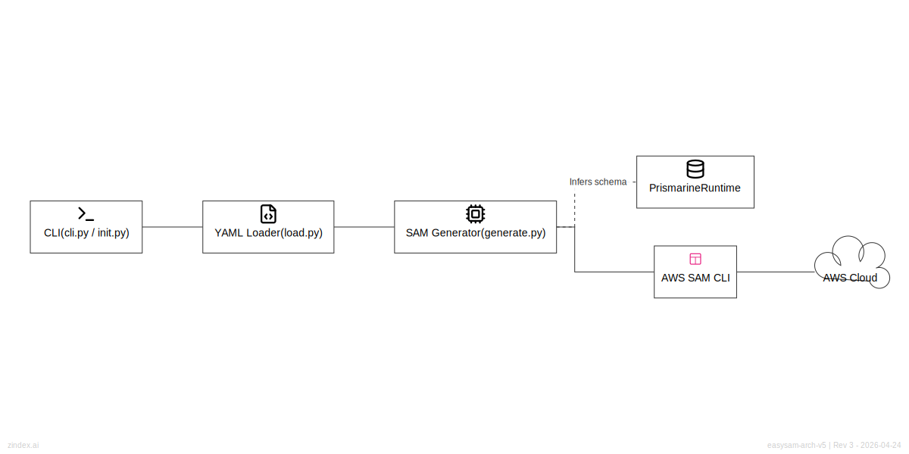

# EasySAM Architecture

EasySAM is a YAML-to-SAM generator that simplifies the development and deployment of serverless applications on AWS.

## High-Level Architecture

## Core Components

- **CLI (`cli.py`, `init.py`)**: The entry point for user interactions. It handles project initialization, resource management commands, and coordinates the overall workflow.
- **YAML Loader (`load.py`)**: Responsible for parsing EasySAM YAML files, resolving imports, and expanding environment variables. It creates an internal representation of the desired infrastructure.
- **SAM Generator (`generate.py`)**: The heart of the tool. It translates the EasySAM internal representation into a valid AWS SAM (Serverless Application Model) template. It also performs schema validation and infers necessary configurations.
- **Prismarine Integration**: EasySAM seamlessly integrates with the Prismarine runtime for advanced DynamoDB modeling and type-safe data access.
- **Deployment Pipeline**: EasySAM leverages the AWS SAM CLI for packaging and deploying the generated templates to the AWS Cloud.

## Key Design Principles

1.  **Convention over Configuration**: EasySAM promotes a standard project hierarchy (e.g., `backend/`, `common/`) to reduce boilerplate and improve maintainability.
2.  **Surgical Updates**: The generator produces precise SAM templates, allowing for targeted infrastructure changes.
3.  **Local-First Development**: Features like environment variable expansion and schema validation enable robust local testing before deployment.
