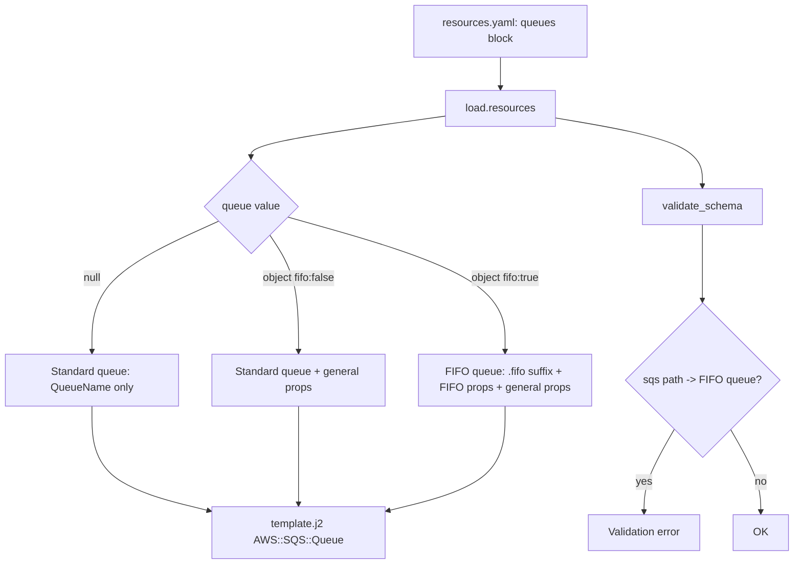

# FIFO Queue Support

## Problem Statement

EasySAM currently supports only standard SQS queues. Queues are declared as null-valued keys under a top-level `queues:` block, and rendered as `AWS::SQS::Queue` resources with a single `QueueName` property. There is no way to declare a FIFO queue or configure queue properties.

We want to add FIFO queue support in addition to standard queues: users mark a queue as FIFO via a config object, configure FIFO-specific and general queue properties (with reasonable defaults), and consume FIFO queues from Lambda functions via `polls` and `send`. FIFO queues as API Gateway `sqs` integration targets are out of scope and must be rejected by validation. The change must be backward compatible — existing null-valued queue declarations continue to work unchanged.

## Requirements

1. A queue value may be either `null` (standard queue, current behavior) or an object with configuration. Both forms are valid; null-valued queues remain standard queues rendered exactly as before.
2. `fifo: true` in the queue config object marks the queue as a FIFO queue.
3. FIFO-specific configurable properties, each with a reasonable default when the queue is FIFO:
   - `content_based_deduplication` → `ContentBasedDeduplication` (default `true`). Note: content-based deduplication auto-derives `MessageDeduplicationId` from a hash of the message body and silently drops messages with an identical body sent within the 5-minute deduplication window. This default is chosen for convenience but differs from the AWS SQS native default (`false`); the behavior must be documented.
   - `deduplication_scope` → `DeduplicationScope`, enum `messageGroup` | `queue` (default `queue`)
   - `fifo_throughput_limit` → `FifoThroughputLimit`, enum `perQueue` | `perMessageGroupId` (default `perQueue`; **automatically set to `perMessageGroupId` when `deduplication_scope` is `messageGroup`**, since CloudFormation rejects `messageGroup` scope combined with `perQueue` throughput limit)
4. General queue properties, applicable to both standard and FIFO queues, rendered only when explicitly provided (no default injected):
   - `visibility_timeout` → `VisibilityTimeout` (integer, 0–43200)
   - `message_retention_period` → `MessageRetentionPeriod` (integer, 60–1209600)
5. For a FIFO queue, the generated `QueueName` must carry the AWS-required `.fifo` suffix. Because queue keys are constrained to `^[a-z0-9-]+$`, the suffix is appended automatically by the template, not written by the user.
6. FIFO queues work as Lambda event sources (`polls`) and send targets (`send`) with no additional user configuration. Existing `SQSPollerPolicy`, `SQSSendMessagePolicy`, and the `SQSEvent` source reference `!GetAtt ...Queue.QueueName` / `.Arn`, which work unchanged for FIFO.
7. A FIFO queue must not be used as an API Gateway `sqs` integration target. Schema validation (`inspect schema`) reports a clear error when a `sqs` path references a FIFO queue.
8. Both the global schema (`schemas.json`) and the local schema (`local_schemas.json`) accept the new queue object form.
9. The feature ships with a runnable example under `example/`, is covered by generation and unit tests, and is documented.

## Background

### Queue Declaration and Schema

`src/easysam/schemas.json` defines the top-level `queues` block as:

```json
"queues": {
  "type": "object",
  "patternProperties": {
    "^[a-z0-9-]+$": { "type": "null" }
  },
  "additionalProperties": false
}
```

There is also an unused `queues_schema` definition (an empty object) that can be repurposed for the queue config object. `src/easysam/local_schemas.json` contains a parallel `queues` block that must be updated to match.

Queue keys are constrained to `^[a-z0-9-]+$`, so users cannot include the `.fifo` suffix in the key. The suffix must be appended in the template's `QueueName`.

### Lambda function consumption of queues

The `lambda_schema` in `schemas.json` already supports:
- `queues`: array of queue names (general grant)
- `send`: array of queue names → `SQSSendMessagePolicy`
- `polls`: `lambda_poll_schema` (array of `{name, batchsize, batchwindow, enabled}`) → SQS event source

`validate_schema.py` validates poll/send names against `resources_data['queues']` (lines ~130–137). These need no change for FIFO.

### Template rendering

`src/easysam/template.j2`:
- Queue loop (lines ~380–388) renders each queue:
  ```jinja
  
  {{ lprefix }}{{ queue_name.replace('-', '') }}Queue:
    Type: AWS::SQS::Queue
    Properties:
      QueueName: !Sub "{{ lprefix }}-{{ queue_name }}-${Stage}"
  
  ```
  Note: with null-valued queues, the loop variable `queue` is `None`. Any new logic must guard against `None`.
- `GatewaySQSRole` IAM role (lines ~231–267) supports API Gateway → SQS integration.
- Function `polls` → `SQSPollerPolicy` (line ~535) + `SQSEvent` source (line ~662) referencing `.QueueName` / `.Arn`.
- Function `send` → `SQSSendMessagePolicy` (line ~566) referencing `.QueueName`.

### API Gateway SQS integration

`src/easysam/swagger.j2` (lines ~65–93) renders the `sqs` integration, referencing `${...Queue.QueueName}`. `validate_schema.py::validate_sqs_path` (line ~199) validates the referenced queue exists. This is where the FIFO restriction (Requirement 7) is enforced.

### Example and generation tests

`example/sqstrigger/` is the existing SQS example: `resources.yaml` declares `testqueue:` (null) and an `authorizers` block; `backend/function/myfunction/easysam.yaml` declares a `polls` config for `testqueue`. `scripts/test_examples_generation.py` renders all examples; per-example unit tests live in `tests/` (e.g. `test_kinesis_multiple_buckets.py`) and assert on rendered template content.

## Proposed Solution

### Data flow



### Queue config object (schema)

Repurpose `queues_schema` in `schemas.json` (and mirror in `local_schemas.json`):

```json
"queues_schema": {
  "type": "object",
  "properties": {
    "fifo": { "type": "boolean" },
    "content_based_deduplication": { "type": "boolean" },
    "deduplication_scope": { "type": "string", "enum": ["messageGroup", "queue"] },
    "fifo_throughput_limit": { "type": "string", "enum": ["perQueue", "perMessageGroupId"] },
    "visibility_timeout": { "type": "integer", "minimum": 0, "maximum": 43200 },
    "message_retention_period": { "type": "integer", "minimum": 60, "maximum": 1209600 }
  },
  "additionalProperties": false
}
```

Top-level `queues` pattern value becomes backward compatible:

```json
"^[a-z0-9-]+$": {
  "oneOf": [
    { "type": "null" },
    { "$ref": "#/definitions/queues_schema" }
  ]
}
```

### Template rendering (queue loop)

Guard against `None` and branch on `fifo`:

```jinja

{{ lprefix }}{{ queue_name.replace('-', '') }}Queue:
  Type: AWS::SQS::Queue
  Properties:
    
    QueueName: !Sub "{{ lprefix }}-{{ queue_name }}-${Stage}.fifo"
    FifoQueue: true
    ContentBasedDeduplication: {{ 'true' if (queue.content_based_deduplication is not defined or queue.content_based_deduplication) else 'false' }}
    DeduplicationScope: {{ queue.deduplication_scope | default('queue') }}
    FifoThroughputLimit: {{ queue.fifo_throughput_limit | default('perMessageGroupId' if queue.deduplication_scope == 'messageGroup' else 'perQueue') }}
    
    QueueName: !Sub "{{ lprefix }}-{{ queue_name }}-${Stage}"
    
    
    VisibilityTimeout: {{ queue.visibility_timeout }}
    
    
    MessageRetentionPeriod: {{ queue.message_retention_period }}
    

```

Standard null-valued queues render exactly as before (only `QueueName`).

### FIFO restriction on API Gateway SQS integration

In `validate_schema.py::validate_sqs_path`, after confirming the queue exists, detect FIFO config and emit an error:

```python
queue_cfg = resources_data['queues'].get(details['queue'])
if isinstance(queue_cfg, dict) and queue_cfg.get('fifo'):
    errors.append(f"SQS path '{path}' cannot target a FIFO queue")
```

## Task Breakdown

### Task 1: Define the FIFO queue schema (global + local)

- **Objective**: Accept a queue value that is either `null` (standard) or a config object with FIFO/general properties, in both schema files.
- **Guidance**: In `src/easysam/schemas.json`, replace the empty `queues_schema` with the object defined in Proposed Solution (properties `fifo`, `content_based_deduplication`, `deduplication_scope`, `fifo_throughput_limit`, `visibility_timeout`, `message_retention_period`; `additionalProperties: false`). Change the top-level `queues` `patternProperties` value to the `oneOf: [null, $ref queues_schema]` form. Apply the equivalent change to `src/easysam/local_schemas.json`. Note: the `deduplication_scope: messageGroup` → `fifo_throughput_limit: perMessageGroupId` dependency (E1) is enforced at render time in the template (Task 2), not by JSON Schema, so an explicit user-supplied combination and the auto-default both resolve correctly.
- **Test requirements**: Add a unit test that runs schema validation over a resources model containing (a) a null-valued standard queue, (b) a `fifo: true` object queue with all properties set, and asserts both pass; and (c) a queue object with an unknown property and asserts it fails. Reuse the validation entry point exercised by existing schema tests. Run the existing schema/example tests to confirm no regressions.
- **Demo**: `uv run easysam --environment dev inspect schema <fixture>` passes for a resources.yaml with both a null queue and a FIFO object queue, and fails when an invalid property is added.

### Task 2: Render FIFO and general queue properties in the SAM template

- **Objective**: Generate correct `AWS::SQS::Queue` CloudFormation for standard (null and object) and FIFO queues.
- **Guidance**: Update the queue loop in `src/easysam/template.j2` (lines ~380–388) per the Proposed Solution snippet. Guard every access to `queue` for `None`. FIFO defaults: `ContentBasedDeduplication: true`, `DeduplicationScope: queue`, `FifoThroughputLimit: perQueue` — **except** that `FifoThroughputLimit` defaults to `perMessageGroupId` when `deduplication_scope == 'messageGroup'` (E1), matching CloudFormation's constraint. Render `ContentBasedDeduplication` with an explicit conditional (`{{ 'true' if (queue.content_based_deduplication is not defined or queue.content_based_deduplication) else 'false' }}`) rather than `| default(true) | lower` so an explicit `false` renders correctly (E3). Render `VisibilityTimeout` / `MessageRetentionPeriod` only when explicitly provided. Do not alter the `polls`/`send`/`SQSEvent` blocks — they already work for FIFO.
- **Test requirements**: Add a unit test that renders a resources model with (a) a null standard queue — assert the block still contains only `QueueName` and no `FifoQueue`; (b) a `fifo: true` queue — assert `QueueName` ends in `.fifo`, `FifoQueue: true`, and the three FIFO defaults are present; (c) a queue with `visibility_timeout`/`message_retention_period` set — assert those keys render; (d) `content_based_deduplication: false` — assert `ContentBasedDeduplication: false` renders (regression guard for E3); and (e) `deduplication_scope: messageGroup` with no explicit throughput limit — assert `FifoThroughputLimit: perMessageGroupId` renders (regression guard for E1).
- **Demo**: `uv run easysam --environment dev generate <fixture>` produces a template whose FIFO queue resource has `FifoQueue: true` and a `.fifo` name, and whose standard queue is unchanged.

### Task 3: Enforce FIFO restriction on API Gateway SQS integration, and queue-name length

- **Objective**: Reject a FIFO queue used as an API Gateway `sqs` integration target (out of scope per requirements), and catch queue names that would exceed the SQS 80-character limit.
- **Guidance**: In `src/easysam/validate_schema.py::validate_sqs_path`, after the existing queue-exists check, add the FIFO detection and error append shown in the Proposed Solution. Leave `polls`/`send` validation unchanged (FIFO is allowed there). Additionally (E2), add a queue-name-length check where queues are validated: for each queue, compute the rendered name length using the deployed pattern — `len(f"{prefix}-{queue_name}-{stage}") + (5 if fifo else 0)` for the `.fifo` suffix — and if it can exceed 80 characters, append a clear error. Use the deploy context's environment/stage when available; if the stage length is not known at schema time, validate against the base `{prefix}-{queue_name}-` portion plus the `.fifo` suffix and document the residual stage-length margin.
- **Test requirements**: Add unit tests that (a) a `sqs` path referencing a FIFO queue produces the expected validation error; (b) a `sqs` path referencing a standard queue produces none; and (c) a queue whose rendered name exceeds 80 characters produces a length error while a normal-length name does not.
- **Demo**: `uv run easysam --environment dev inspect schema <fixture>` fails with a clear message when a `sqs` path targets a FIFO queue, and when a queue name is too long.

### Task 4: Add a FIFO example and generation test

- **Objective**: Provide a runnable example and lock in generated output.
- **Guidance**: Create `example/fifoqueue/` modeled on `example/sqstrigger/`: a `resources.yaml` declaring a FIFO queue (e.g. `orders: { fifo: true, content_based_deduplication: true }`) and a standard queue for contrast, plus a `backend/function/<fn>/easysam.yaml` with a `polls` and/or `send` config referencing the FIFO queue. Ensure the example is discovered by `scripts/test_examples_generation.py`. Add a focused test `tests/test_fifoqueue.py` mirroring `tests/test_kinesis_multiple_buckets.py`, asserting the FIFO queue renders with `.fifo`, `FifoQueue: true`, and defaults, and that the Lambda has the poller/send policy.
- **Test requirements**: Run `scripts/test_examples_generation.py` and `tests/test_fifoqueue.py`; both pass. Run the full test suite to confirm no regressions.
- **Demo**: `uv run easysam --environment dev generate example/fifoqueue` renders a stack with a FIFO queue consumed by a Lambda poll.

### Task 5: Update documentation

- **Objective**: Document FIFO queue configuration and its limitation.
- **Guidance**: Update `docs/RESOURCE_REFERENCE.md` queues section with the new object form, all properties, their defaults, the automatic `.fifo` suffix, the automatic `perMessageGroupId` throughput limit when `deduplication_scope` is `messageGroup`, and the API-Gateway-target limitation. Also document the Operational Considerations from that section of this spec: head-of-line blocking and the `batchsize: 1` recommendation (X1), the 5-minute content-based deduplication window and its divergence from the AWS default (P1), and the standard→FIFO CloudFormation replacement/message-loss behavior (P2). Add a short FIFO queues note to `README.md`, an entry to `CHANGELOG.md`, and a line to `example/README.md` for the new example. Do not hand-edit generated `openwiki/` pages — let OpenWiki regenerate.
- **Test requirements**: N/A (docs). Run any existing docs/link checks if present.
- **Demo**: Docs show how to declare a FIFO queue, list defaults, and state the API Gateway limitation.

## Out of Scope

- API Gateway `sqs` integration targeting a FIFO queue (would require `MessageGroupId`/`MessageDeduplicationId` handling in the swagger request template). Explicitly rejected by validation in Task 3.
- Dead-letter queue / redrive policy configuration (not requested for V1).
- KMS encryption configuration for queues (not requested).

## Operational Considerations (for implementers and documentation)

These are not features to build, but constraints that must be surfaced in `docs/RESOURCE_REFERENCE.md` (Task 5) and honored by validation (Task 3):

- **Head-of-line blocking (X1)**: In a FIFO queue, a poison message that repeatedly fails a `polls` consumer blocks all processing for that `MessageGroupId` until the message is resolved or expires. Because DLQ/redrive is out of scope for V1, documentation must advise consumers to catch exceptions within the Lambda handler and, where per-record failure isolation matters, to use `batchsize: 1`.
- **Content-based deduplication window (P1)**: With `content_based_deduplication: true` (the EasySAM default), SQS derives `MessageDeduplicationId` from a hash of the message body and silently drops messages with an identical body sent within a 5-minute window. This differs from the AWS SQS native default (`false`) and must be documented prominently. The default remains `true` for producer convenience.
- **Standard→FIFO replacement (P2)**: AWS SQS cannot convert an existing standard queue to FIFO in place. Changing `myqueue: null` to `myqueue: { fifo: true }` in `resources.yaml` triggers CloudFormation resource replacement (delete + recreate), which can lose in-flight messages. Document this migration behavior.
- **Queue name 80-char limit (E2)**: SQS enforces an 80-character maximum on queue names. The rendered FIFO name `{{ lprefix }}-{{ queue_name }}-${Stage}.fifo` (including the `.fifo` suffix) can breach this with long prefix/name/stage combinations; see the name-length validation added in Task 3.
