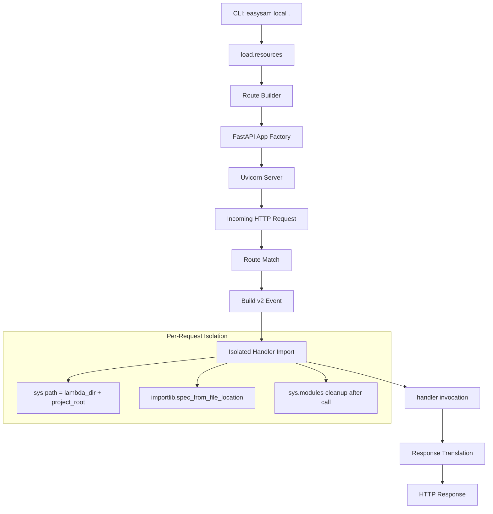

# Local Lambda Execution Mode

## Problem Statement

EasySAM needs a local HTTP server command (`easysam local .`) that mocks API Gateway routing, allowing Lambda handler code to be called directly without deployment. Real cloud resources (DynamoDB, S3, SQS, etc.) remain on AWS — only the API Gateway routing and auth layers are mocked locally.

## Requirements

1. FastAPI-based local HTTP server started via `uv run easysam --environment dev local . --port 3000`
2. API Gateway HTTP API (v2) event format for synthesized events
3. Per-request isolated handler imports using `importlib.util.spec_from_file_location` to handle conflicting local module names across lambdas
4. `sys.path` set per-invocation to `[lambda_uri_dir, project_root]` so `common/` resolves directly from source (no deploy-time copy)
5. Greedy routes resolved using the existing `greedy` boolean from integration definitions
6. Environment variables loaded from `.env` + `envvars` clauses (global and per-function) in resource definitions
7. CORS wide-open by default (all origins, methods, headers)
8. Authorizers bypassed in local mode
9. Separate `local invoke <function> --event file.json` command for non-HTTP triggers (SQS/Kinesis/DynamoDB stream)
10. No hot reload in v1 (deferred)
11. Function URLs exposed as additional routes at `/__fn/<function_name>`

## Background

### Resource Loading

`load.resources()` (in `src/easysam/load.py`) parses `resources.yaml` + recursively imported `easysam.yaml` files into a `benedict` dict containing:

- `functions`: dict keyed by function name, each with:
  - `uri`: relative path to the lambda source directory
  - `envvars`: optional dict of environment variables
  - `tables`, `timeout`, `memory`, `schedule`, `functionurl`, etc.
- `paths`: dict keyed by API path (e.g., `/items`), each with:
  - `function`: function name
  - `open`: boolean (auth bypass — irrelevant locally)
  - `greedy`: boolean (catch-all routing)
  - `integration`: "lambda"
- `envvars`: global environment variables (top-level)
- `prefix`: stack name prefix

### Lambda Handler Convention

- Handler file: `<project_root>/<uri>/index.py`
- Handler function: `handler(event, context)`
- Common imports: `import common.utils as u` (resolves from `common/` at project root)
- Some lambdas have same-named local modules (e.g., both have `helpers.py`)

### Deployment-Time Common Resolution

During `deploy`, `commondep.py` AST-analyzes each lambda's imports, copies only the used `common/` modules into each lambda's directory. In local mode, we skip this entirely — just add project root to `sys.path`.

### Greedy Routes

When `greedy: true` (or path ends with `/`), EasySAM generates both a root route (`/items`) and a proxy route (`/items/{proxy+}`). The local server must replicate this by registering both a fixed path and a catch-all path.

### Existing CLI Pattern

Commands are Click-based, registered in `cli.py`. Each command receives `ctx.obj` with `verbose`, `aws_profile`, and `deploy_ctx`. The `deploy_ctx` dict contains `environment` and `target_region`.

## Proposed Solution

### Architecture



### Handler Isolation Strategy

```python
import importlib.util
import sys
import uuid
from pathlib import Path
from contextlib import contextmanager

@contextmanager
def isolated_import_context(project_root: Path, lambda_dir: Path):
    """Temporarily set sys.path for isolated handler import."""
    original_path = sys.path[:]
    original_modules = set(sys.modules.keys())

    sys.path = [str(lambda_dir), str(project_root)] + sys.path

    try:
        yield
    finally:
        sys.path = original_path
        # Remove modules added during this import
        new_modules = set(sys.modules.keys()) - original_modules
        for mod in new_modules:
            del sys.modules[mod]


def load_and_invoke(project_root: Path, lambda_dir: Path, event: dict, context) -> dict:
    """Load handler in isolation and invoke it."""
    handler_path = lambda_dir / 'index.py'
    module_name = f"_easysam_local_{uuid.uuid4().hex[:8]}"

    with isolated_import_context(project_root, lambda_dir):
        spec = importlib.util.spec_from_file_location(module_name, handler_path)
        module = importlib.util.module_from_spec(spec)
        spec.loader.exec_module(module)
        handler = module.handler
        return handler(event, context)
```

### Event Format (HTTP API v2)

```python
{
    "version": "2.0",
    "routeKey": "GET /items",
    "rawPath": "/items",
    "rawQueryString": "page=1&limit=10",
    "headers": {"content-type": "application/json", ...},
    "queryStringParameters": {"page": "1", "limit": "10"},
    "pathParameters": {"id": "123"},
    "body": "...",
    "isBase64Encoded": False,
    "requestContext": {
        "http": {
            "method": "GET",
            "path": "/items",
            "sourceIp": "127.0.0.1"
        },
        "time": "03/Aug/2026:17:00:00 +0000",
        "timeEpoch": 1785934800000
    }
}
```

### Route Mapping

| EasySAM Definition | FastAPI Route(s) |
|---|---|
| `/items` (greedy: false) | `"/items"` — all methods |
| `/items` (greedy: true) | `"/items"` + `"/items/{path:path}"` — all methods |
| Function URL `hello-world` | `"/__fn/hello-world"` — all methods |

### Environment Variable Strategy

1. Load `.env` file from project root (already done by `load.resources()`)
2. Set global `envvars` from `resources_data['envvars']` into `os.environ`
3. Before each handler invocation, temporarily set per-function `envvars` from `functions[name]['envvars']`
4. Restore after invocation

### New Dependencies

- `fastapi` — HTTP framework
- `uvicorn[standard]` — ASGI server

## Task Breakdown

### Task 1: Add FastAPI + uvicorn dependencies

- **Objective:** Add `fastapi` and `uvicorn[standard]` to project dependencies
- **Implementation:** Update `pyproject.toml` dependencies list
- **Test:** `uv sync` succeeds; `python -c "import fastapi; import uvicorn"` exits 0
- **Demo:** `uv sync && python -c "import fastapi; import uvicorn"`

### Task 2: Handler isolation module — `src/easysam/local_handler.py`

- **Objective:** Build a utility that loads a Lambda handler from a file path with per-invocation `sys.path` isolation and `sys.modules` cleanup
- **Implementation:**
  - `isolated_import_context(project_root, lambda_dir)` — context manager for path isolation
  - `load_and_invoke(project_root, lambda_dir, event, context)` — loads handler, invokes, returns response
  - `MockLambdaContext` class with `function_name`, `memory_limit_in_mb`, `invoked_function_arn`, `aws_request_id`
- **Test:** Create two temp lambdas, each with a `helpers.py` defining different values. Invoke both in sequence. Verify each returns its own value (no cross-contamination via `sys.modules`).
- **Demo:** `pytest tests/test_local_handler.py -v`

### Task 3: API Gateway v2 event builder — `src/easysam/local_event.py`

- **Objective:** Build a function that constructs an HTTP API v2 event dict from a Starlette/FastAPI Request
- **Implementation:**
  - `build_http_api_event(request, path_params, route_key) -> dict`
  - Handles: method, path, query string, headers (lowercase), body (with base64 for binary), requestContext with timestamps
  - `create_mock_context(function_name) -> MockLambdaContext`
- **Test:** Unit test building events from mock requests; verify structure matches AWS v2 format for GET with query params, POST with JSON body, and request with path parameters.
- **Demo:** `pytest tests/test_local_event.py -v`

### Task 4: Route builder — `src/easysam/local_routes.py`

- **Objective:** Convert loaded resource `paths` and `functions` dicts into a list of route descriptors for FastAPI registration
- **Implementation:**
  - `RouteInfo` dataclass: `path`, `function_name`, `lambda_dir`, `is_greedy`, `is_function_url`
  - `build_routes(resources_data, project_root) -> list[RouteInfo]`
  - Greedy expansion: register both exact path and `{path:path}` catch-all
  - Function URL routes: `/__fn/<name>` for each function with `functionurl` property
- **Test:** Unit test with sample resources_data containing greedy, non-greedy, and function-url entries; verify correct route list.
- **Demo:** `pytest tests/test_local_routes.py -v`

### Task 5: FastAPI app factory — `src/easysam/local_server.py`

- **Objective:** Wire together routes, handler loading, event building, and response translation into a FastAPI app
- **Implementation:**
  - `create_app(resources_data, project_root) -> FastAPI`
  - CORS middleware: allow all
  - For each `RouteInfo`, register a route handler that:
    1. Sets per-function envvars
    2. Builds v2 event from request
    3. Calls `load_and_invoke` with isolation
    4. Translates handler response dict to HTTP response (statusCode, headers, body)
    5. Restores envvars
  - Error handling: 500 with traceback on handler exception
  - Response translation supports both `body` as string and as dict (auto-JSON)
- **Test:** Integration test using FastAPI `TestClient` with `example/myapp`: request to `/items` returns 200 with expected body from `common.utils.my_common_function()`.
- **Demo:** `pytest tests/test_local_server.py -v`

### Task 6: CLI `local` command — `src/easysam/local_cli.py` + wire into `cli.py`

- **Objective:** Add `easysam local .` command that starts the local server
- **Implementation:**
  - New Click group `local` in `src/easysam/local_cli.py`
  - Default subcommand (or group invoke): start server
  - Options: `--port` (default 3000), `--host` (default 127.0.0.1)
  - Logic: load resources → set global envvars → create app → `uvicorn.run(app, host, port)`
  - Register in `cli.py`: `easysam.add_command(local)` alongside `inspect`
- **Test:** Invoke `easysam local --help` and verify it shows options without error.
- **Demo:** `uv run easysam --environment dev local . --port 3000`

### Task 7: CLI `local invoke` command

- **Objective:** Add `easysam local invoke <function> --event file.json` for non-HTTP trigger testing
- **Implementation:**
  - Subcommand `invoke` under the `local` group
  - Arguments: function name (required), `--event` path to JSON file (required)
  - Logic: load resources → resolve function uri → load handler in isolation → call with event from file → print response JSON to stdout
  - Error if function name not found in resources
- **Test:** Invoke a handler with a mock DynamoDB stream event JSON; verify stdout contains expected response.
- **Demo:** `uv run easysam --environment dev local invoke myfunction --event tests/fixtures/stream-event.json`

### Task 8: End-to-end integration test

- **Objective:** Verify the full local server flow works against `example/myapp`
- **Implementation:**
  - `tests/test_local_e2e.py`
  - Load `example/myapp` resources, create app, use `TestClient`
  - Test: GET `/items` → 200, body contains output from `my_common_function()`
  - Test: undefined route → 404
  - Test: global envvars accessible in handler
- **Test:** `pytest tests/test_local_e2e.py -v`
- **Demo:** All assertions pass, confirming round-trip from resource loading through handler invocation
