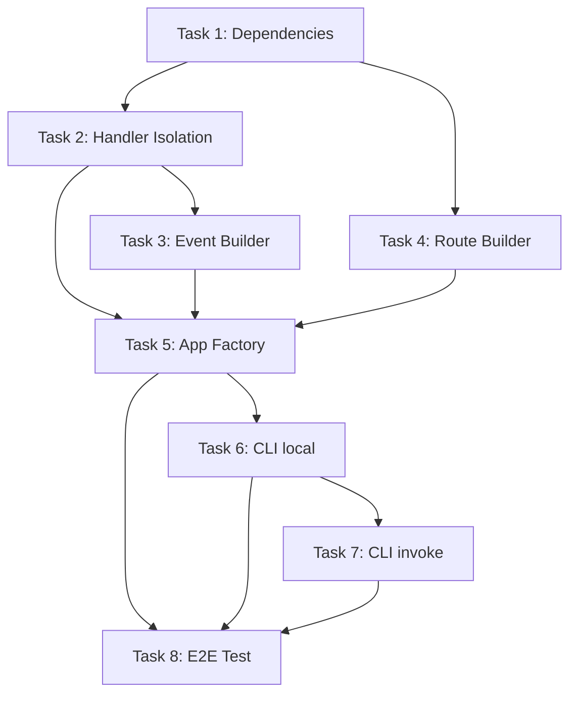

# Local Lambda Execution — Task Summary & Orchestration

**Spec:** `docs/specs/local-lambda-execution.md`  
**Feature:** `easysam local .` — local HTTP server mocking API Gateway

---

## Task Index

| # | Task | File | Status |
|---|------|------|--------|
| 1 | [Add FastAPI + uvicorn dependencies](task-1-dependencies.md) | `pyproject.toml` | [ ] |
| 2 | [Handler isolation module](task-2-handler-isolation.md) | `src/easysam/local_handler.py` | [ ] |
| 3 | [API Gateway event builder](task-3-event-builder.md) | `src/easysam/local_event.py` | [ ] |
| 4 | [Route builder](task-4-route-builder.md) | `src/easysam/local_routes.py` | [ ] |
| 5 | [FastAPI app factory](task-5-app-factory.md) | `src/easysam/local_server.py` | [ ] |
| 6 | [CLI `local` command](task-6-cli-local.md) | `src/easysam/local_cli.py` + `cli.py` | [ ] |
| 7 | [CLI `local invoke` command](task-7-cli-invoke.md) | `src/easysam/local_cli.py` | [ ] |
| 8 | [End-to-end integration test](task-8-e2e-test.md) | `tests/test_local_e2e.py` | [ ] |

---

## Dependency Graph

---

## Parallel Execution Strategy

### Wave 1 (no dependencies)
- **Task 1**: Add dependencies to `pyproject.toml`

### Wave 2 (depends on Task 1)
- **Task 2**: Handler isolation — can start immediately after deps installed
- **Task 4**: Route builder — pure logic, no external deps needed (can technically start in parallel with Wave 1 since it only uses stdlib)

### Wave 3 (depends on Task 2)
- **Task 3**: Event builder — imports `MockLambdaContext` from Task 2

### Wave 4 (depends on Tasks 2, 3, 4)
- **Task 5**: App factory — integrates all building blocks

### Wave 5 (depends on Task 5)
- **Task 6**: CLI `local` command — wires app factory into CLI
- **Task 8**: E2E test — can be written in parallel with Task 6 (both depend on `create_app`)

### Wave 6 (depends on Task 6)
- **Task 7**: CLI `local invoke` — subcommand under the `local` group

---

## Key Implementation Notes

1. **Event format default is `v1`** (REST API) — matches current EasySAM SAM template generation
2. **Handler isolation** uses `importlib.util.spec_from_file_location` with full `sys.modules` purge of local paths on every request
3. **Thread safety**: `asyncio.Lock()` + `try...finally` around all `os.environ` mutations
4. **Route order matters**: non-greedy before greedy to prevent Starlette shadowing
5. **Auth context** is global stub injection, not per-route
6. **Response normalization**: v2 allows simple dict returns; v1 requires explicit `statusCode`/`body`

---

## Verification Checklist

After all tasks complete:

- [ ] `uv run easysam --environment dev local example/myapp --port 3000` starts and responds to `/items`
- [ ] `uv run easysam --environment dev local invoke myfunction --event '{}'` outputs handler response
- [ ] `pytest tests/test_local_handler.py tests/test_local_event.py tests/test_local_routes.py tests/test_local_server.py tests/test_local_e2e.py -v` — all pass
- [ ] `--event-format v2` produces v2-format events
- [ ] `--auth-context '{"principalId": "x"}'` injects into requestContext
- [ ] Two lambdas with conflicting `helpers.py` modules don't cross-contaminate
