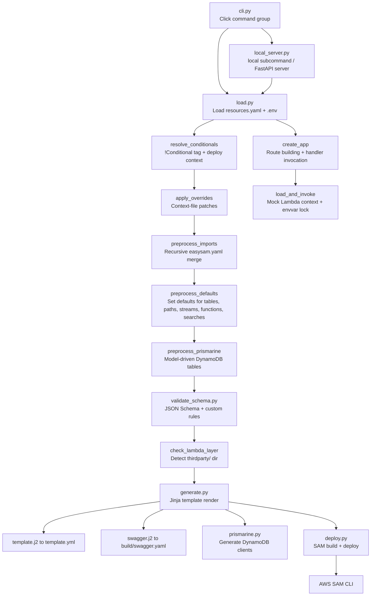

# Architecture Overview

EasySAM follows a linear pipeline for cloud generation and deployment: **YAML input → recursive import → conditional resolution → schema validation → Jinja template rendering → SAM CLI build/deploy**. A separate local execution path reuses the same loading and resource model to run Lambda handlers locally through a FastAPI server.

Each stage is a discrete Python module under `src/easysam/`. The CLI entry point is `cli.py`; the local execution server is `local_server.py`.

## Pipeline flowchart

*The EasySAM pipeline from CLI invocation to AWS deployment, plus the local execution path that reuses the loader and routes requests to Lambda handlers.*

## Module roles

| Module | Role |
| --- | --- |
| `cli.py` | Click command group with global options (`--environment`, `--aws-profile`, `--context-file`, `--target-region`, `--verbose`). Commands: `init`, `generate`, `deploy`, `delete`, `cleanup`, `inspect`. Registers `inspect` and `local` sub-groups in `main()`. |
| `load.py` | Core loading engine. Reads `resources.yaml`, loads `.env`, resolves `!Conditional` tags, applies overrides, recursively imports `easysam.yaml` files, preprocesses Prismarine tables, sets defaults, detects third-party Lambda layer support, and sorts resource sections. |
| `generate.py` | Orchestrates generation: calls `load.resources`, invokes plugins, renders `template.j2` and `swagger.j2` via Jinja2, calls `prismarine.generate` for client code. Wraps top-level failures in `FatalError`. |
| `deploy.py` | SAM CLI wrapper: version checks (pip, SAM), common dependency copy/cleanup, `sam build`, `sam deploy` with tags/region/profile, and post-deploy reconciliation of event source mappings. `delete` runs via CloudFormation `delete_stack`. |
| `local_server.py` | FastAPI application factory for local Lambda execution. `local()` loads resources, sets envvars, and runs a uvicorn server; `create_app()` builds routes; per-request handler invokes Lambda code under a serialization lock with per-function envvar swapping. |
| `inspect.py` | Debug sub-group: `inspect schema` (validate + render), `inspect cloud` (live AWS validation), `inspect common-deps` (trace common/ imports). |
| `validate_schema.py` | JSON Schema (Draft 7) validation against `schemas.json` (global) and `local_schemas.json` (per-file). Custom validators for buckets, tables, streams, lambdas, paths, imports, prismarine, authorizers, MQTT. |
| `validate_cloud.py` | Live AWS validation: checks IAM policies for bucket `extaccesspolicy`, resolves SSM parameters for custom Lambda layers. |
| `prismarine.py` | Generates Prismarine DynamoDB client code (`prismarine_client.py`) from model definitions. Supports TypedDict and Pydantic modelling. |
| `init.py` | Scaffolds a new EasySAM project: creates `resources.yaml`, `common/`, `backend/function/`, `thirdparty/`, and `.gitignore` entries. Supports `--prismarine` mode. |
| `commondep.py` | AST-based dependency tracer: scans Python files for `common.*` imports and recursively resolves transitive common dependencies for deployment packaging. |
| `definitions.py` | Defines `FatalError` exception and `ProcessingResult` type alias. |
| `utils.py` | `get_aws_client` — creates boto3 session/client with optional profile. |

## Key design decisions

- **Recursive imports:** `resources.yaml` lists `import` directories; EasySAM recursively finds all `easysam.yaml` files and merges their `lambda`, `tables`, and nested `import` entries into the top-level model. See [Resource Model](../domain/resource-model.md).
- **Conditionals before validation:** `!Conditional` tags are resolved against deploy context (`environment`, `target_region`) before schema validation, so validators only see resources that apply to the target deployment. Unresolved conditions raise `FatalError`.
- **Jinja for SAM templates:** The entire SAM template is a single Jinja file (`template.j2`, ~30 KB) that renders CloudFormation YAML from the resolved resources dict. This is the core output artifact.
- **Prismarine as sub-pipeline:** Prismarine model-driven tables are injected into `resources_data['tables']` during preprocessing, then client code is generated after the SAM template. See [Prismarine Integration](../domain/prismarine.md).
- **FatalError pattern:** `FatalError` (defined in `definitions.py`) wraps a list of error strings and is raised when a condition cannot be resolved (e.g., missing deploy context key). It is caught in `generate.py` and reflected by `inspect.py` to produce structured error output.
- **Local execution reuses the cloud pipeline:** `local_server.py` calls the same `load.resources` loader, then maps resolved `paths` to FastAPI routes and invokes Lambda handlers with a thread-safe envvar lock. It is intended for development against the same resource model that drives deployment.

## Template rendering

The [generate workflow](../workflows/generate-deploy.md) renders two Jinja templates:

1. **`template.j2`** → `template.yml` — the SAM/CloudFormation template with all AWS resources
2. **`swagger.j2`** → `build/swagger.yaml` — OpenAPI 3.0 spec for API Gateway (only if `paths` are defined)

Both templates live in `src/easysam/` and are loaded via `FileSystemLoader` with the package directory first, then the project directory. Users can override the main template with `--override-main-template`.

## Local execution server flow

The `local` subcommand (and `local_server.local()` facade) starts a local HTTP server that mocks API Gateway routing and invokes Lambda handlers directly:

1. Load and resolve resources with `load.resources` using the same deploy context.
2. Set global envvars from `resources_data['envvars']`.
3. Inject `AWS_DEFAULT_REGION`/`AWS_REGION` from `target_region` and `AWS_PROFILE` from the CLI profile or env var.
4. Build a FastAPI app with CORS wide open for local development and register one route per API path.
5. For each request, build the Lambda event outside a serialization lock, then invoke the handler under an `asyncio.Lock` while swapping per-function envvars, and restore them afterward.
6. Normalize the Lambda result to an HTTP response (status code, body, headers, base64 decoding).

This allows integration testing of paths and handlers without deploying to AWS.
