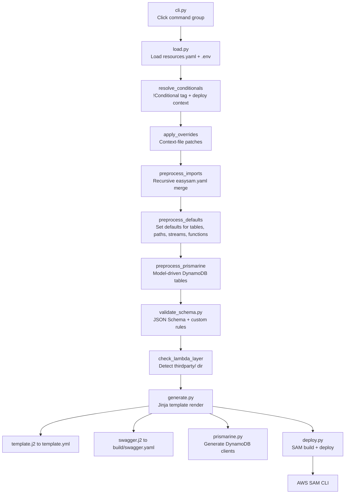

# Architecture Overview

EasySAM follows a linear pipeline: **YAML input → recursive import → conditional resolution → schema validation → Jinja template rendering → SAM CLI build/deploy**. Each stage is a discrete Python module under `src/easysam/`.

## Pipeline flowchart

*The EasySAM pipeline from CLI invocation to AWS deployment.*

## Module roles

| Module | Role |
| --- | --- |
| `cli.py` | Click command group: `init`, `generate`, `deploy`, `delete`, `inspect` subcommands. Global options set deploy context. |
| `load.py` | Core loading engine. Reads `resources.yaml`, loads `.env`, resolves `!Conditional` tags, applies overrides, recursively imports `easysam.yaml` files, sets defaults, and invokes Prismarine preprocessing. |
| `generate.py` | Orchestrates the full generation: calls `load.resources`, renders `template.j2` and `swagger.j2` via Jinja2, invokes plugins, and calls Prismarine client generation. |
| `deploy.py` | Wraps SAM CLI: checks pip/SAM versions, copies common dependencies, runs `sam build` and `sam deploy`, manages cleanup. Also implements `delete` via CloudFormation. |
| `inspect.py` | Click sub-group for debugging: `inspect schema` (validate + render), `inspect cloud` (cloud resource checks), `inspect common-deps` (trace common/ imports). |
| `validate_schema.py` | JSON Schema (Draft 7) validation against `schemas.json` (global) and `local_schemas.json` (per-file). Custom validators for buckets, tables, streams, lambdas, paths, imports, prismarine, authorizers, MQTT. |
| `validate_cloud.py` | Live AWS validation: checks IAM policies for bucket `extaccesspolicy`, resolves SSM parameters for custom Lambda layers. |
| `prismarine.py` | Generates Prismarine DynamoDB client code (`prismarine_client.py`) from model definitions. Supports TypedDict and Pydantic modelling. |
| `init.py` | Scaffolds a new EasySAM project: creates `resources.yaml`, `common/`, `backend/function/`, `thirdparty/`, and `.gitignore` entries. Supports `--prismarine` mode. |
| `commondep.py` | AST-based dependency tracer: scans Python files for `common.*` imports and recursively resolves transitive common dependencies for deployment packaging. |
| `definitions.py` | Defines `FatalError` exception and `ProcessingResult` type alias. |
| `utils.py` | `get_aws_client` — creates boto3 session/client with optional profile. |

## Key design decisions

- **Recursive imports:** `resources.yaml` lists `import` directories; EasySAM recursively finds all `easysam.yaml` files and merges their `lambda`, `tables`, and nested `import` entries into the top-level model. See [Resource Model](../domain/resource-model.md).
- **Conditionals before validation:** `!Conditional` tags are resolved against deploy context (`environment`, `target_region`) before schema validation, so validators only see resources that apply to the target deployment.
- **Jinja for SAM templates:** The entire SAM template is a single Jinja file (`template.j2`, ~30 KB) that renders CloudFormation YAML from the resolved resources dict. This is the core output artifact.
- **Prismarine as sub-pipeline:** Prismarine model-driven tables are injected into `resources_data['tables']` during preprocessing, then client code is generated after the SAM template. See [Prismarine Integration](../domain/prismarine.md).
- **FatalError pattern:** `FatalError` (defined in `definitions.py`) wraps a list of error strings and is raised when a condition cannot be resolved (e.g., missing deploy context key). It is caught in `generate.py` and `inspect.py` to produce structured error output. Recent commits (327a9f2, 2682989) refined this pattern by removing redundant exception wrapping.

## Template rendering

The [generate workflow](../workflows/generate-deploy.md) renders two Jinja templates:

1. **`template.j2`** → `template.yml` — the SAM/CloudFormation template with all AWS resources
2. **`swagger.j2`** → `build/swagger.yaml` — OpenAPI 3.0 spec for API Gateway (only if `paths` are defined)

Both templates live in `src/easysam/` and are loaded via `FileSystemLoader` with the package directory first, then the project directory. Users can override the main template with `--override-main-template`.
