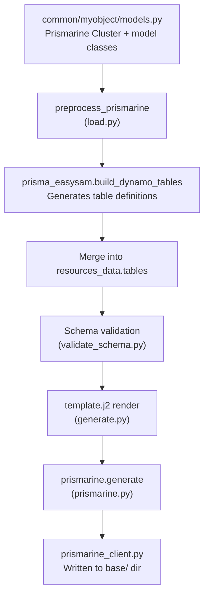

# Prismarine Integration

Prismarine is an external Python library (`prismarine>=1.6.0` on PyPI) that EasySAM uses for model-driven DynamoDB table definitions. Instead of manually writing table schemas in YAML, you define Python model classes and Prismarine generates both the DynamoDB table definitions and a typed client library.

EasySAM consumes Prismarine at two distinct stages of the pipeline: during **preprocessing** (in `load.py`) to inject DynamoDB table definitions into `resources_data`, and after **template rendering** (in `prismarine.py`) to write the generated `prismarine_client.py`.

## Pipeline overview



*Prismarine runs twice: once during loading to inject table definitions into `resources_data`, and once after Jinja template rendering to produce typed client code.*

## Two integration points

### 1. Preprocessing — table generation (load.py)

During `preprocess_resources` (called from `load.resources`), before schema validation:

1. If `prismarine.conditional-tables` is present, it is resolved via `resolve_conditionals` against the deploy context and matching entries are appended to `prismarine.tables`
2. For each table integration entry, `prismarine_dynamo_tables` is called:
   - Sets `prisma_common.set_path(pypath)` for module resolution
   - Resolves the `base` directory relative to `resources_dir`
   - Loads the model cluster via `prisma_common.get_cluster(base_dir, package)`
   - Calls `prisma_easysam.build_dynamo_tables(prefix, cluster)` to generate table definitions
3. Generated tables are merged into `resources_data['tables']`
4. If the integration entry does **not** set `trigger: true`, model-defined triggers are removed from the generated table definitions

This means Prismarine-generated tables go through the same schema validation and Jinja template rendering as manually-defined tables.

Source: `repo://src/easysam/load.py#L113-L179`

### 2. Client code generation (prismarine.py)

After the SAM template is rendered in `generate.generate` (line 86–88), Prismarine client code is generated:

1. Reads the `prismarine` config from resolved resources
2. For each table integration, calls `prisma_client.get_cluster(base_dir, package)` to load the cluster
3. Validates that the cluster prefix starts with the master prefix from `resources['prefix']`
4. Calls `prisma_client.build_client(cluster, base_dir, base, access_module, extra_imports, model_library=modelling)`
5. Writes `prismarine_client.py` to the `base` directory if no errors have been recorded for that package

If errors have been recorded, client generation for that package is skipped with a warning. Client generation is not skipped globally — each package is evaluated independently.

Source: `repo://src/easysam/prismarine.py#L7-L58`

The orchestration in `generate.py` calls `generate_prismarine_clients` only when `'prismarine' in resources_data`:

```python
if 'prismarine' in resources_data:
    lg.info('Generating prismarine clients')
    generate_prismarine_clients(resources_dir, resources_data, errors)
```

Source: `repo://src/easysam/generate.py#L86-L88`

## Configuration

Defined under the `prismarine:` key in `resources.yaml`:

```yaml
prismarine:
  default-base: common
  access-module: common.dynamo_access
  modelling: typed-dict          # or: pydantic
  extra-imports:
    - common.myobject.models:NestedItem
  tables:
    - package: myobject
      base: common               # overrides default-base
      trigger: true              # keep model-defined triggers
  conditional-tables:
    ? !Conditional
      key: prod-tables
      environment: prod
    :
      - package: prodobject
```

| Field | Description |
| --- | --- |
| `default-base` | Default directory containing model packages (required; validated as an existing directory) |
| `access-module` | Python module providing DynamoDB access (default: `prismarine.runtime.dynamo_default`) |
| `modelling` | `typed-dict` (default) or `pydantic` |
| `extra-imports` | Additional classes to import, format `module:ClassName` |
| `tables` | List of `{package, base, trigger}` entries |
| `conditional-tables` | Environment/region-conditional table packages (resolved via `!Conditional`) |

Source: `repo://src/easysam/load.py#L136-L149` and `repo://src/easysam/prismarine.py#L7-L17`

## Model definition

Models are defined as Python classes using Prismarine's `Cluster` decorator pattern. From the scaffolded `init.py` templates:

```python
from typing import TypedDict, NotRequired
from prismarine.runtime import Cluster

c = Cluster('MyApp')

@c.model(PK='Foo', SK='Bar', trigger='itemlogger')
class Item(TypedDict):
    Foo: str
    Bar: str
    Baz: NotRequired[str]
```

The cluster prefix (`'MyApp'`) **must start with** the EasySAM `prefix` from `resources.yaml` — this is validated in `prismarine.py` and an error is appended if it does not match.

Source: `repo://src/easysam/prismarine.py#L43-L49` and scaffold templates in `repo://src/easysam/init.py#L134-L147`

### TTL support

Models can declare a `ttl` attribute on the `@c.model` decorator:

```python
@c.model(PK='Foo', SK='Bar', ttl='ExpireAt')
class Item(TypedDict):
    Foo: str
    Bar: str
    ExpireAt: int
```

The `ttl` field name is passed through to the generated DynamoDB table definition. Example: `example/prismarinettl`.

### Stream triggers

Models can define a `trigger` attribute (e.g., `@c.model(trigger='itemlogger')`). The trigger name refers to a Lambda function defined elsewhere in the project (typically in a `backend/function/<name>/easysam.yaml` file). Example: `example/prismarine`.

## Access module

The `access-module` (default scaffold: `common.dynamo_access`) provides the DynamoDB connection layer. The scaffolded implementation:

```python
import boto3
from prismarine.runtime.dynamo_access import DynamoAccess
from common.utils import get_env

class MyDynamoAccess(DynamoAccess):
    def get_resource(self):
        return boto3.resource('dynamodb')

    def get_table(self, full_model_name: str):
        env = get_env()
        return self.get_resource().Table(f'{full_model_name}-{env}')

dynamoaccess = MyDynamoAccess()

def get_dynamo_access():
    return dynamoaccess
```

The access module is injected into the generated client, allowing runtime table resolution with environment suffixing. The module is resolved from the `base` directory, so `common.dynamo_access` means `common/dynamo_access.py`.

Source: `repo://example/prismarine/common/dynamo_access.py` and scaffold in `repo://src/easysam/init.py#L115-L131`

## The `db.py` re-export pattern

The generated `prismarine_client.py` creates a `ItemModel` class (named after the model class) but lives in the package directory (e.g., `common/myobject/prismarine_client.py`). The scaffold creates a `db.py` in the same package that re-exports the client model:

```python
import common.myobject.prismarine_client as pc

class ItemModel(pc.ItemModel):
    pass
```

This pattern lets application code import `ItemModel` from `common.myobject.db` without depending on the generated `__init__` import structure. The `db.py` file is created by `init.py` when `--prismarine` mode is used, alongside `models.py`.

Source: `repo://example/prismarine/common/myobject/db.py` and `repo://src/easysam/init.py#L149-L155`

## Generated client code

After template rendering, `prismarine_client.py` is written to the `base` directory (e.g., `common/myobject/prismarine_client.py`). The generated file:

- Imports from `prismarine.runtime.dynamo_crud` (CRUD primitives: `_query`, `_get_item`, `_put_item`, `_update`, `_delete`, `_scan`, `_save`, `Model`, `without`, `DbNotFound`)
- Imports the model classes from `common.myobject.models`
- Instantiates the DynamoDB resource via `get_dynamo_access()`
- Defines a `ItemModel` class with typed CRUD methods: `list`, `get`, `put`, `update`, `save`, `delete`, `scan`

Source: `repo://example/prismarine/common/myobject/prismarine_client.py`

The generated client header includes a version stamp: `# This file is generated by prismarine 1.6.1. Do not modify it.`

### TypedDict mode (default)

In `typed-dict` mode, the generated `UpdateDTO` is a `TypedDict` with `total=False`, and methods accept and return plain `TypedDict` instances. No runtime validation occurs.

Source: `repo://example/prismarine/common/myobject/prismarine_client.py#L28-L36`

### Pydantic mode

In `pydantic` mode, the generated client:

- Defines a `_build_pydantic_update_model` helper that creates a Pydantic `UpdateDTO` with all fields made optional
- Uses `_dump_model` / `_load_model` helpers to serialize/deserialize between Pydantic models and dict payloads
- Injects `pydantic` imports into the generated file

Requires Prismarine ≥ 1.5.5 (fixed in v1.11.1).

Source: `repo://example/prismapydantic/common/myobject/prismarine_client.py#L1-L100`

Example Pydantic models:

```python
from pydantic import BaseModel, Field
from prismarine.runtime import Cluster

c = Cluster('PrismaPydantic')

@c.export
class NestedItem(BaseModel):
    NestedFoo: str = Field(description='The nested foo attribute')

@c.model(PK='Foo', SK='Bar')
class Item(BaseModel):
    Foo: str = Field(description='The Foo attribute')
    Bar: str = Field(description='The Bar attribute')
    Baz: Optional[str] = Field(description='The Baz attribute')
    Nested: NestedItem = Field(description='The Nested attribute')
```

Note: the `@c.export` decorator on `NestedItem` makes it available for `extra-imports` so it can be referenced by the `Item` model.

Source: `repo://example/prismapydantic/common/myobject/models.py`

## Trigger handling

Prismarine models can define a `trigger` attribute (e.g., `@c.model(trigger='itemlogger')`). During preprocessing in `preprocess_prismarine`:

- If the `prismarine.tables` entry has `trigger: true`, the model-defined trigger is **preserved** in the generated table definition
- Otherwise, the trigger is **stripped** from the generated table definition (key `trigger` is popped)

This allows models to define triggers for documentation while controlling whether they're active per-deployment.

Source: `repo://src/easysam/load.py#L172-L177`

### Conditional triggers

Triggers themselves can be conditional. In `example/prismarineconditionals`, the trigger value is wrapped in a `!Conditional`:

```yaml
prismarine:
  tables:
    - package: myobject
      trigger:
        ? !Conditional
          key: function
          environment:
            - prodsam
            - stagingsam
        : itemlogger
```

When the condition does not match (e.g., `environment: dev`), the trigger value resolves to `None` / is absent, so no trigger is attached to the table. When it matches, the trigger name `itemlogger` is set.

Source: `repo://example/prismarineconditionals/resources.yaml`

## Conditional table packages

The `conditional-tables` key allows table packages to be included only for specific environments or regions. It uses the same `!Conditional` YAML tag and `resolve_conditionals` machinery as the rest of the resource model:

```yaml
prismarine:
  conditional-tables:
    ? !Conditional
      key: tables
      environment:
        - prodsam
        - stagingsam
    :
      - package: condition
```

Resolution flow:

1. `preprocess_prismarine` pops `conditional-tables` from the prismarine config
2. Calls `resolve_conditionals(raw_conditional, deploy_ctx, errors)`
3. Iterates resolved values; for each list of tables, extends `prisma['tables']`

Source: `repo://src/easysam/load.py#L143-L148`

## Modelling modes

| Mode | Description |
| --- | --- |
| `typed-dict` | Default. Uses Python `TypedDict` for model definitions. Lightweight, no runtime validation. Generated `UpdateDTO` is a `TypedDict` with `total=False`. |
| `pydantic` | Uses Pydantic models. Provides runtime validation and serialization. Generated client uses Pydantic's `model_dump`/`model_validate` for (de)serialization and dynamically builds an update DTO. Requires Prismarine ≥ 1.5.5 (fixed in v1.11.1). |

Source: `repo://src/easysam/prismarine.py#L17` and `repo://example/prismapydantic/resources.yaml`

## Scaffolding

When `easysam init --prismarine` is run, the following files are created:

- `common/dynamo_access.py` — DynamoDB access module
- `common/myobject/models.py` — Prismarine Cluster + model classes
- `common/myobject/db.py` — re-export of generated `ItemModel`
- `backend/function/itemlogger/easysam.yaml` — trigger Lambda definition
- `backend/function/itemlogger/index.py` — DynamoDB stream handler

The standard (non-Prismarine) scaffold creates `backend/database/easysam.yaml` instead of the model package and trigger lambda.

Source: `repo://src/easysam/init.py#L204-L278`

## Examples

| Example | Focus |
| --- | --- |
| `example/prismarine/` | TypedDict models with stream trigger lambda (`itemlogger`) |
| `example/prismarinettl/` | Model-level TTL (`@c.model(ttl='ExpireAt')`) |
| `example/prismapydantic/` | Pydantic modelling with CRUD integration test (`test_item_crud.py`) |
| `example/prismarineconditionals/` | Conditional Prismarine resources via `conditional-tables` and conditional triggers |

## Validation

Schema validation for the `prismarine` section is handled in `validate_schema.py:validate_prismarine`:

- If `prismarine` is absent, validation returns immediately
- `default-base` must be an existing directory (relative to `resources_dir`)
- Each table entry's `base` (or `default-base`) must be an existing directory

Source: `repo://src/easysam/validate_schema.py#L255-L275`

## Relationship to other domains

- **Resource model** (`/openwiki/domain/resource-model.md`): Prismarine config lives under the `prismarine:` key in `resources.yaml` and participates in the same conditional resolution and override machinery as other resource sections.
- **Generate and deploy workflow** (`/openwiki/workflows/generate-deploy.md`): Prismarine client generation is the last step in the generate path, after template rendering.
- **Source map** (`/openwiki/architecture/source-map.md`): `prismarine.py` is listed as the Prismarine integration module; `load.py` handles preprocessing; `validate_schema.py` handles Prismarine-specific validation.
