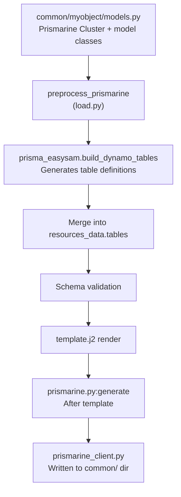

# Prismarine Integration

Prismarine is an external Python library (`prismarine>=1.6.0` on PyPI) that EasySAM uses for model-driven DynamoDB table definitions. Instead of manually writing table schemas in YAML, you define Python model classes and Prismarine generates both the DynamoDB table definitions and a client library.

## Two integration points

Prismarine interacts with EasySAM at two stages of the pipeline:



*Prismarine runs twice: once during loading to inject table definitions, and once after template generation to produce client code.*

## Configuration

Defined under the `prismarine:` key in `resources.yaml`:

```yaml
prismarine:
  default-base: common
  access-module: common.dynamo_access
  modelling: typed-dict          # or: pydantic
  extra-imports:
    - common.myobject.models:NestedItem
  tables:
    - package: myobject
      base: common               # overrides default-base
      trigger: true              # keep model-defined triggers
  conditional-tables:
    ? !Conditional
      key: prod-tables
      environment: prod
    :
      - package: prodobject
```

| Field | Description |
| --- | --- |
| `default-base` | Default directory containing model packages |
| `access-module` | Python module providing DynamoDB access (default: `prismarine.runtime.dynamo_default`) |
| `modelling` | `typed-dict` (default) or `pydantic` |
| `extra-imports` | Additional classes to import, format `module:ClassName` |
| `tables` | List of `{package, base, trigger}` entries |
| `conditional-tables` | Environment/region-conditional table packages (resolved via `!Conditional`) |

## Model definition

Models are defined as Python classes using Prismarine's `Cluster` decorator pattern. From `init.py` scaffold:

```python
from typing import TypedDict, NotRequired
from prismarine.runtime import Cluster

c = Cluster('MyApp')

@c.model(PK='Foo', SK='Bar', trigger='itemlogger')
class Item(TypedDict):
    Foo: str
    Bar: str
    Baz: NotRequired[str]
```

The cluster prefix (`'MyApp'`) must start with the EasySAM `prefix` from `resources.yaml` — this is validated in `prismarine.py`.

## Table generation (preprocessing)

Source: `load.py:preprocess_prismarine`, `prismarine_dynamo_tables`

During loading (`preprocess_resources`), before schema validation:

1. Resolves `conditional-tables` via `!Conditional` and appends matching entries to `prismarine.tables`
2. For each table package, calls `prisma_common.get_cluster` to load the model cluster from the `base` directory
3. Calls `prisma_easysam.build_dynamo_tables(prefix, cluster)` to generate table definitions
4. Merges generated tables into `resources_data['tables']`
5. If the integration entry does not set `trigger: true`, removes any model-defined triggers from generated tables

This means Prismarine-generated tables go through the same schema validation and Jinja template rendering as manually-defined tables.

## Client code generation

Source: `src/easysam/prismarine.py`

After the SAM template is rendered (in `generate.py`), Prismarine client code is generated:

1. Reads `prismarine` config from resolved resources
2. For each table package, calls `prisma_client.get_cluster` and `prisma_client.build_client`
3. Writes `prismarine_client.py` to the `base` directory (e.g., `common/`)
4. The client provides typed CRUD access to the DynamoDB tables

If any errors occurred during the pipeline, client generation is skipped with a warning.

## Access module

The `access-module` (default scaffold: `common.dynamo_access`) provides the DynamoDB connection layer. The scaffolded implementation:

```python
class MyDynamoAccess(DynamoAccess):
    def get_resource(self):
        return boto3.resource('dynamodb')
    def get_table(self, full_model_name: str):
        env = get_env()
        return self.get_resource().Table(f'{full_model_name}-{env}')
```

The access module is injected into the generated client, allowing runtime table resolution with environment suffixing.

## Modelling modes

| Mode | Description |
| --- | --- |
| `typed-dict` | Default. Uses Python `TypedDict` for model definitions. Lightweight, no runtime validation. |
| `pydantic` | Uses Pydantic models. Provides runtime validation and serialization. Requires Prismarine ≥ 1.5.5 (fixed in v1.11.1). |

## Trigger handling

Prismarine models can define a `trigger` attribute (e.g., `@c.model(trigger='itemlogger')`). During preprocessing:

- If the `prismarine.tables` entry has `trigger: true`, the model-defined trigger is preserved
- Otherwise, the trigger is stripped from the generated table definition

This allows models to define triggers for documentation while controlling whether they're active per-deployment.

## Examples

| Example | Focus |
| --- | --- |
| `example/prismarine/` | TypedDict models with stream trigger lambda |
| `example/prismarinettl/` | Model-level TTL (`ttl='ExpireAt'`) |
| `example/prismapydantic/` | Pydantic modelling with CRUD integration test |
| `example/prismarineconditionals/` | Conditional Prismarine resources via `conditional-tables` |
