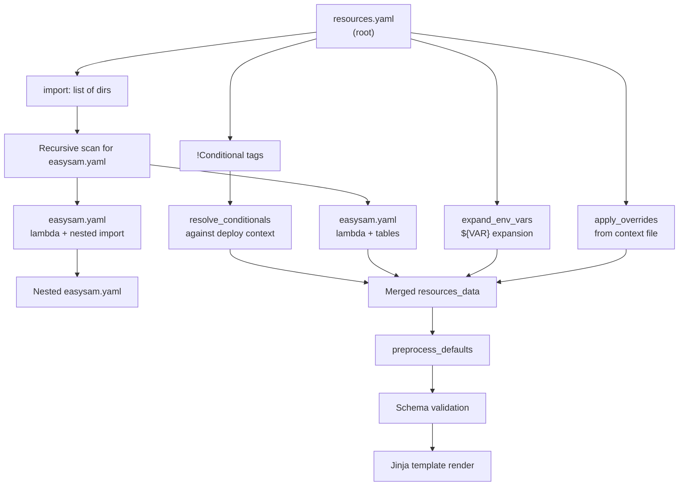

# Resource Model

EasySAM uses a two-tier YAML model: a root `resources.yaml` defines global resources and import directories, and per-directory `easysam.yaml` files define local lambdas, tables, and nested imports.

## Two-tier model



*How resources.yaml and easysam.yaml files merge into the final template input.*

## Root `resources.yaml`

Required field: `prefix` (used in all generated resource names).

Key sections (see `docs/RESOURCE_REFERENCE.md` for full field reference):

| Section | Type | Description |
| --- | --- | --- |
| `prefix` | string | **Required.** Name prefix for all generated AWS resources |
| `python` | string | Lambda runtime version (default: `3.13`) |
| `tags` | map | CloudFormation stack tags |
| `envvars` | map | Global Lambda environment variables |
| `import` | list | Directories to scan for `easysam.yaml` files |
| `buckets` | map | S3 bucket definitions (`public`, `extaccesspolicy`) |
| `queues` | map | SQS queue definitions (keys are queue names) |
| `streams` | map | Kinesis streams + Firehose S3 destinations |
| `tables` | map | DynamoDB table definitions (attributes, indices, TTL, triggers) |
| `functions` | map | Lambda function definitions |
| `paths` | map | API Gateway integrations (lambda, dynamo, sqs) |
| `authorizers` | map | API Gateway Lambda authorizers |
| `prismarine` | object | Prismarine model integration config |
| `plugins` | map | Custom Jinja plugin templates |
| `mqtt` | object | IoT Core custom authorizer + topics |
| `search` | object | OpenSearch Serverless collections |

## Local `easysam.yaml`

Found recursively under each `import` directory. Supported keys:

- **`lambda`** — defines a Lambda function with `name`, `resources`, `integration`, `functionurl`, `timeout`, `memory`, `schedule`
- **`tables`** — local table definitions merged into the global `tables` map
- **`import`** — nested import paths (relative to the file's directory), enabling recursive composition

Example:

```yaml
lambda:
  name: myfunction
  resources:
    tables:
      - MyItem
  integration:
    path: /items
    open: true
    greedy: false
```

When `lambda` is present, EasySAM:
1. Extracts `name` and registers it in `functions` (error on duplicates)
2. Derives `uri` from the file's directory relative to the project root (if not explicitly set)
3. Creates an API Gateway path entry from `integration` (error on duplicate paths)
4. Promotes `functionurl`, `timeout`, `memory`, `schedule` into the function resource

Local tables are merged into the global `tables` map (error on duplicates).

## Conditional resources (`!Conditional`)

Source: `load.py:Conditional`, `conditional_constructor`, `resolve_conditionals`, `check_condition`

Conditional keys allow environment/region-specific resources. They use a custom YAML tag `!Conditional`:

```yaml
buckets:
  ? !Conditional
    key: my-bucket
    environment: prod
    region: eu-west-2
  :
    public: true
```

Resolution rules:
- `environment` and `region` are matched against deploy context (`--environment`, `--target-region`)
- `region` in the conditional maps to `target_region` in deploy context
- `any` (default) matches all values
- Lists are OR-matched: `environment: [prod, staging]`
- Negation with `~`: `environment: ~prod` matches anything except `prod`
- If a condition key is missing from deploy context, a `FatalError` is raised

Conditionals are resolved **before** schema validation and **before** imports are processed, so only applicable resources enter the validation pipeline.

### Conditional tables in Prismarine

Prismarine supports a `conditional-tables` key under `prismarine:` that uses the same `!Conditional` mechanism. Resolved tables are appended to `prismarine.tables`. See [Prismarine Integration](prismarine.md).

## Deploy context overrides

A YAML context file passed via `--context-file` can patch any resource property using dot-path syntax:

```yaml
overrides:
  buckets/my-bucket/public: true
  functions/myfunction/timeout: 60
```

Applied by `apply_overrides` in `load.py` after conditionals are resolved but before imports and defaults.

## Environment variable expansion

Source: `load.py:expand_env_vars`

- `.env` files in the project root are loaded via `python-dotenv` if present
- `${VAR}` syntax is expanded recursively in all string values and dict keys in both `resources.yaml` and `easysam.yaml`
- Expansion happens immediately after each file is loaded, before conditional resolution

The global `ACCOUNT_ID` environment variable (`AWS::AccountId`) is always available in Lambda functions via the template's Globals section.

## Default normalization

`preprocess_defaults` in `load.py` applies several normalizations:

| Resource | Default |
| --- | --- |
| Tables: `trigger` | String triggers converted to `{'function': name}`; `viewtype` defaults to `new-and-old`; `startingposition` defaults to `latest` |
| Paths: `integration` | Defaults to `lambda`; `greedy` defaults to `true` for lambda integration |
| Paths: dynamo integration | `action` defaults to `GetItem` |
| Paths: sqs integration | `method` defaults to `post` |
| Streams | Simple `bucketname` form normalized to `buckets: {private: {...}}`; `intervalinseconds` defaults to 300 |
| Functions: `polls` | String poll names converted to `{'name': name}` |
| Functions: `searches` | Empty list defaults to `['searchable']` |
| Search | Empty `search:` normalized to default `searchable` collection |

## Sorting

After preprocessing, all dict-valued sections are sorted alphabetically by key, and list-valued sections are sorted. The top-level `resources_data` dict is also sorted. This ensures deterministic template output.
