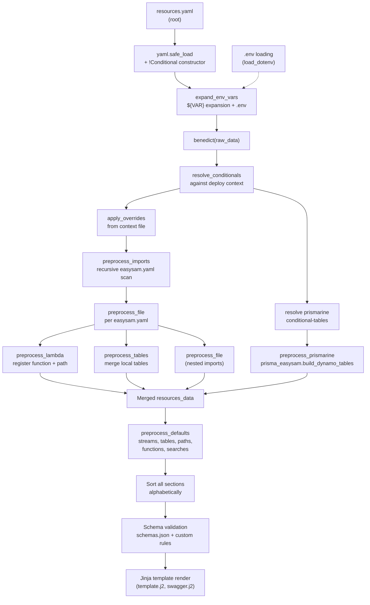

# Resource Model

EasySAM uses a two-tier YAML model: a root `resources.yaml` defines global resources and import directories, and per-directory `easysam.yaml` files define local lambdas, tables, and nested imports. The entire resource lifecycle — from raw YAML parsing through conditional resolution, overrides, local import processing, defaults normalization, schema validation, and final sorted output — is orchestrated in `load.py`.

## Lifecycle overview



*How resources.yaml and easysam.yaml files merge into the final template input.*

## Root `resources.yaml`

Required field: `prefix` (used in all generated resource names). Validated as required by `schemas.json`.

Key sections (see `docs/RESOURCE_REFERENCE.md` for full field reference):

| Section | Type | Description |
| --- | --- | --- |
| `prefix` | string | **Required.** Name prefix for all generated AWS resources |
| `python` | string | Lambda runtime version, enum: `3.12`, `3.13`, `3.14` (default: `3.13`) |
| `tags` | map | CloudFormation stack tags (keys match `^[a-z0-9-]+$`) |
| `envvars` | map | Global Lambda environment variables (keys match `^[A-Z][A-Z0-9-_]+$`) |
| `import` | list\<string\> | Directories to scan for `easysam.yaml` files |
| `buckets` | map | S3 bucket definitions (`public`, `extaccesspolicy`) |
| `queues` | map | SQS queue definitions (keys are queue names, values null) |
| `streams` | map | Kinesis streams + Firehose S3 destinations |
| `tables` | map | DynamoDB table definitions (attributes, indices, TTL, triggers) |
| `functions` | map | Lambda function definitions |
| `paths` | map | API Gateway integrations (lambda, dynamo, sqs) |
| `authorizers` | map | API Gateway Lambda authorizers |
| `prismarine` | object | Prismarine model integration config |
| `plugins` | map | Custom Jinja plugin templates |
| `mqtt` | object/null | IoT Core custom authorizer + topics |
| `search` | object/null | OpenSearch Serverless collections |

Source: `repo://src/easysam/load.py#L56-L110`, `repo://src/easysam/schemas.json#L617-L775`

## Loading pipeline

The `resources()` function in `load.py` is the main entry point. It follows this sequence:

1. **Locate and load `resources.yaml`** from `resources_dir` (line 75)
2. **Load `.env`** if present via `python-dotenv` (lines 77–80)
3. **Register the `!Conditional` YAML constructor** and parse the file with `yaml.safe_load` (lines 83–84)
4. **Expand environment variables** recursively via `expand_env_vars` (line 85)
5. **Wrap in `benedict`** for dot-path access (line 86)
6. **Resolve conditionals** against the deploy context (line 93)
7. **Apply overrides** from the context file (line 98)
8. **Preprocess resources**: imports, Prismarine, defaults, sorting (lines 102–103, 392–413)
9. **Validate** against `schemas.json` plus custom validators (line 105)
10. **Check lambda layer** availability by testing for `thirdparty/` directory (line 108)

Source: `repo://src/easysam/load.py#L56-L110`

## Local `easysam.yaml`

Found recursively under each `import` directory (via `import_dir.glob(f'**/{IMPORT_FILE}')` where `IMPORT_FILE = 'easysam.yaml'`). Supported keys:

- **`lambda`** — defines a Lambda function with `name`, `resources`, `integration`, `functionurl`, `timeout`, `memory`, `schedule`
- **`tables`** — local table definitions merged into the global `tables` map
- **`import`** — nested import paths (relative to the file's directory), enabling recursive composition

Example:

```yaml
lambda:
  name: myfunction
  resources:
    tables:
      - MyItem
  integration:
    path: /items
    open: true
    greedy: false
```

When `lambda` is present, EasySAM:

1. Extracts `name` and registers it in `functions` (error on duplicates) — `repo://src/easysam/load.py#L199-L201`
2. Derives `uri` from the file's directory relative to the project root if not explicitly set — `repo://src/easysam/load.py#L217-L219`
3. Creates an API Gateway path entry from `integration` (error on duplicate paths) — `repo://src/easysam/load.py#L225-L243`
4. Promotes `functionurl`, `timeout`, `memory`, `schedule` into the function resource — `repo://src/easysam/load.py#L205-L215`

Local tables are merged into the global `tables` map (error on duplicates) — `repo://src/easysam/load.py#L246-L256`.

Each `easysam.yaml` is loaded, has its `!Conditional` tags resolved, is validated against `local_schemas.json`, then processed for lambda, tables, and nested imports. — `repo://src/easysam/load.py#L259-L290`

### Local schema

The local schema (`local_schemas.json`) validates per-file `easysam.yaml` content. It allows `lambda`, `tables`, and `import` keys. The `lambda` object requires `name` and allows optional `resources`, `timeout`, `memory`, `functionurl`, `schedule`, and `integration` (requiring `path`).

Source: `repo://src/easysam/local_schemas.json#L310-L381`

## Conditional resources (`!Conditional`)

Source: `repo://src/easysam/load.py#L421-L497`

Conditional keys allow environment/region-specific resources. They use a custom YAML tag `!Conditional`:

```yaml
buckets:
  ? !Conditional
    key: my-bucket
    environment: prod
    region: eu-west-2
  :
    public: true
```

The `Conditional` class stores `key`, `environment` (default `'any'`), and `region` (default `'any'`). The `conditional_constructor` requires `key` to be present and raises `ValueError` otherwise. — `repo://src/easysam/load.py#L421-L443`

### Resolution rules

`resolve_conditionals` recursively walks the data structure. When it encounters a `Conditional` key:

1. It checks `environment` against `deploy_ctx['environment']` via `check_condition`
2. It checks `region` against `deploy_ctx['target_region']` via `check_condition`
3. Both conditions must be true (AND logic) for the entry to be included
4. The resolved value is stored under `key.key` (the actual resource key)

Source: `repo://src/easysam/load.py#L471-L497`

`check_condition` implements the matching logic:

- `any` (default) matches all values — `repo://src/easysam/load.py#L447-L448`
- Lists are OR-matched: `environment: [prod, staging]` — `repo://src/easysam/load.py#L450-L451`
- Negation with `~`: `environment: ~prod` matches anything except `prod` — `repo://src/easysam/load.py#L463-L464`
- If a condition key is missing from deploy context, a `FatalError` is raised — `repo://src/easysam/load.py#L455-L461`

Resolution happens at two points:

- **Root `resources.yaml`**: after env var expansion, before imports and defaults — `repo://src/easysam/load.py#L91-L95`
- **Each `easysam.yaml`**: after loading and env var expansion, before local schema validation — `repo://src/easysam/load.py#L273-L277`
- **Prismarine `conditional-tables`**: inside `preprocess_prismarine`, after popping from the prismarine config — `repo://src/easysam/load.py#L143-L148`

Conditionals are resolved **before** schema validation and **before** imports are processed, so only applicable resources enter the validation pipeline.

### Conditional tables in Prismarine

Prismarine supports a `conditional-tables` key under `prismarine:` that uses the same `!Conditional` mechanism. `preprocess_prismarine` pops `conditional-tables`, resolves it via `resolve_conditionals`, and appends matching table entries to `prismarine.tables`. See [Prismarine Integration](prismarine.md).

Source: `repo://src/easysam/load.py#L143-L148`

## Deploy context overrides

A YAML context file passed via `--context-file` can patch any resource property using dot-path syntax. The context file's `overrides` map is loaded into `deploy_ctx` and applied by `apply_overrides` in `load.py`:

```yaml
overrides:
  buckets/my-bucket/public: true
  functions/myfunction/timeout: 60
```

Applied by `apply_overrides` after conditionals are resolved but before imports and defaults. The override path uses `/` as separator, which `apply_overrides` converts to `.` for `benedict` key assignment. — `repo://src/easysam/load.py#L500-L505`

## Environment variable expansion

Source: `repo://src/easysam/load.py#L40-L53`

- `.env` files in the project root are loaded via `python-dotenv` if present — `repo://src/easysam/load.py#L77-L80`
- `${VAR}` syntax is expanded recursively in all string values and dict keys in both `resources.yaml` and `easysam.yaml` via `os.path.expandvars` — `repo://src/easysam/load.py#L40-L53`
- Expansion happens immediately after each file is loaded, before conditional resolution
- The global `ACCOUNT_ID` environment variable (`AWS::AccountId`) is always available in Lambda functions via the template's Globals section

The `expand_env_vars` function handles three types recursively:

- **dict**: expand keys and values
- **list**: expand each element
- **str**: expand via `os.path.expandvars`
- **other**: pass through unchanged

## Default normalization

`preprocess_defaults` in `load.py` applies several normalizations before schema validation:

Source: `repo://src/easysam/load.py#L384-L389`

| Resource | Default | Function |
| --- | --- | --- |
| Tables: `trigger` | String triggers converted to `{'function': name}`; `viewtype` defaults to `new-and-old`; `startingposition` defaults to `latest` | `process_default_tables` — `repo://src/easysam/load.py#L367-L381` |
| Paths: `integration` | Defaults to `lambda`; `greedy` defaults to `true` for lambda integration | `process_default_paths` — `repo://src/easysam/load.py#L352-L364` |
| Paths: dynamo integration | `action` defaults to `GetItem` | `process_default_paths` — `repo://src/easysam/load.py#L358-L359` |
| Paths: sqs integration | `method` defaults to `post` | `process_default_paths` — `repo://src/easysam/load.py#L360-L361` |
| Streams | Simple `bucketname` form normalized to `buckets: {private: {...}}`; `intervalinseconds` defaults to 300 | `process_default_streams` — `repo://src/easysam/load.py#L325-L349` |
| Functions: `polls` | String poll names converted to `{'name': name}` | `process_default_functions` — `repo://src/easysam/load.py#L306-L318` |
| Functions: `searches` | Empty list defaults to `['searchable']` | `process_default_functions` — `repo://src/easysam/load.py#L320-L322` |
| Search | Empty `search:` normalized to default `searchable` collection | `process_default_searches` — `repo://src/easysam/load.py#L508-L516` |

## Sorting

After preprocessing, all dict-valued sections are sorted alphabetically by key, and list-valued sections are sorted. The top-level `resources_data` dict is also sorted. This ensures deterministic template output. — `repo://src/easysam/load.py#L395-L413`

## Schema validation

The resolved and preprocessed `resources_data` is validated in two stages:

1. **JSON Schema Draft 7 validation** against `schemas.json` (global) or `local_schemas.json` (per `easysam.yaml`) — `repo://src/easysam/validate_schema.py#L8-L52`
2. **Custom validators** for domain-specific rules — `repo://src/easysam/validate_schema.py#L25-L34`

Custom validators include:

| Validator | Responsibility |
| --- | --- |
| `validate_buckets` | Bucket `private` cannot be public — `repo://src/easysam/validate_schema.py#L68-L72` |
| `validate_tables` | Trigger function must be a valid function — `repo://src/easysam/validate_schema.py#L75-L82` |
| `validate_streams` | Exactly one of `bucketname` or `extbucketarn`; bucketname must reference a valid bucket; extbucketarn must be a valid ARN — `repo://src/easysam/validate_schema.py#L85-L108` |
| `validate_lambda` | Referenced buckets, tables, queues, streams, searches must exist; mqtt service requires mqtt config — `repo://src/easysam/validate_schema.py#L110-L155` |
| `validate_paths` | Lambda paths: authorizer and open are mutually exclusive, one must be present; authorizer must be valid; SQS paths: queue must be valid; template files must exist — `repo://src/easysam/validate_schema.py#L158-L242` |
| `validate_import` | Import directories must exist — `repo://src/easysam/validate_schema.py#L245-L253` |
| `validate_prismarine` | `default-base` directory must exist; table `base` directories must exist — `repo://src/easysam/validate_schema.py#L255-L275` |
| `validate_authorizers` | Exactly one identity type (token/query/headers); function must be valid — `repo://src/easysam/validate_schema.py#L277-L286` |
| `validate_mqtt` | Authorizer function must be valid — `repo://src/easysam/validate_schema.py#L289-L298` |

## Prismarine table generation

When `prismarine` is present in `resources_data`, `preprocess_prismarine` runs as part of `preprocess_resources` before defaults and sorting. — `repo://src/easysam/load.py#L398-L399`

The flow:

1. Pop and resolve `conditional-tables` against deploy context — `repo://src/easysam/load.py#L143-L148`
2. For each table integration in `prismarine.tables`:
   - Resolve `base` (defaults to `prisma.get('default-base')`) — `repo://src/easysam/load.py#L152`
   - Require `package` — `repo://src/easysam/load.py#L159-L161`
   - Call `prismarine_dynamo_tables(prefix, base, package, ...)` — `repo://src/easysam/load.py#L163`
   - This sets `prisma_common.set_path(pypath)`, resolves the base directory, loads the cluster via `prisma_common.get_cluster`, and calls `prisma_easysam.build_dynamo_tables(prefix, cluster)` — `repo://src/easysam/load.py#L123-L128`
3. Generated tables are merged into `resources_data['tables']` — `repo://src/easysam/load.py#L169-L179`
4. If the integration entry does **not** set `trigger: true`, model-defined triggers are removed from generated tables — `repo://src/easysam/load.py#L175-L177`

Generated Prismarine tables go through the same schema validation and Jinja template rendering as manually-defined tables.

Source: `repo://src/easysam/load.py#L113-L179`, `repo://src/easysam/prismarine.py#L7-L58`

## Supported sections

The `SUPPORTED_SECTIONS` list in `load.py` defines which top-level keys are recognized during sorting:

```python
SUPPORTED_SECTIONS = [
    'tables',
    'paths',
    'functions',
    'buckets',
    'authorizers',
    'prismarine',
    'import',
    'lambda',
    'search',
    'mqtt',
]
```

Source: `repo://src/easysam/load.py#L23-L34`

Note that `lambda` appears here for local `easysam.yaml` processing but is not a top-level `resources.yaml` key — top-level lambdas are defined under `functions`.

## Errors and fatal conditions

Errors are collected in a `list[str]` passed through the entire pipeline. Fatal errors (missing deploy context keys for conditionals) raise `FatalError` which stops processing immediately. Other errors (duplicate names, missing directories, validation failures) are appended to the list and processing continues, allowing multiple errors to be reported together.

Source: `repo://src/easysam/load.py#L455-L461`, `repo://src/easysam/definitions.py`
