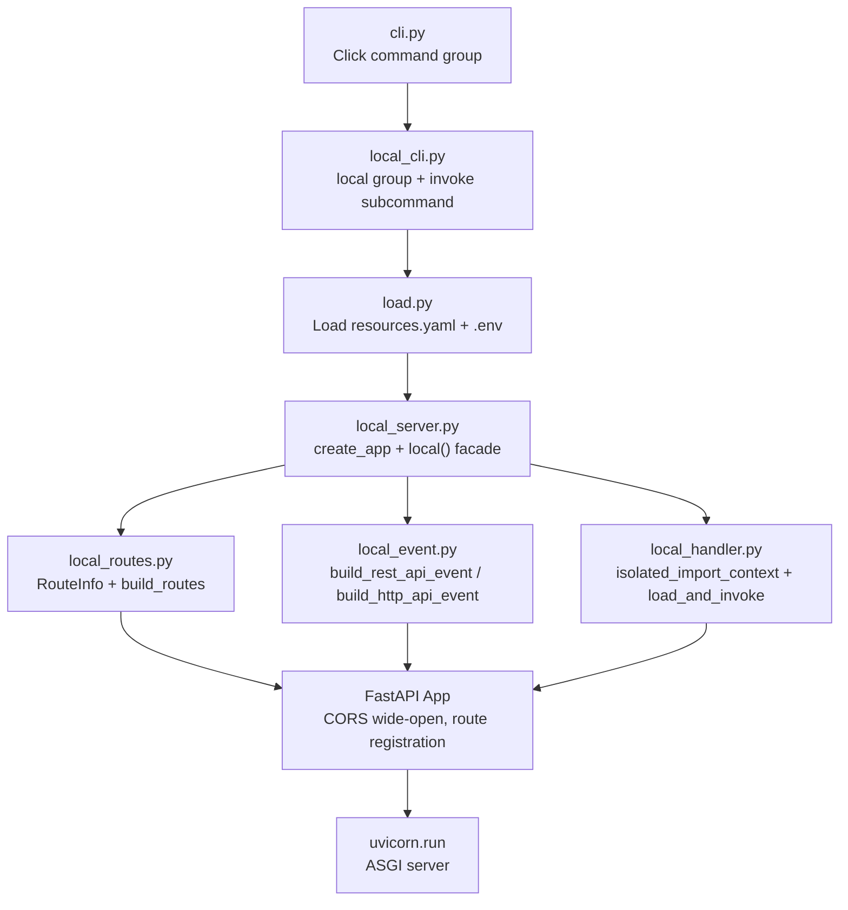
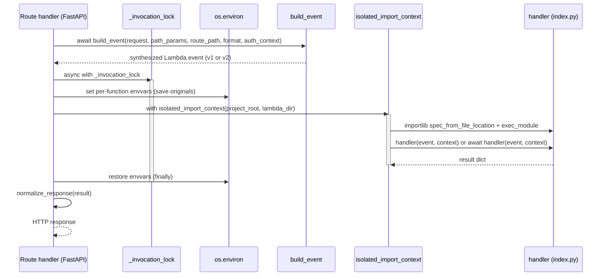

# Local Execution Deep Dive

EasySAM's local execution mode lets developers run Lambda handlers against the same resource model that drives deployment, without packaging or deploying to AWS. Two CLI commands are exposed: `easysam local .` starts a FastAPI + uvicorn server that mocks API Gateway routing, and `easysam local invoke <function>` invokes a single handler with a custom event. Real cloud resources (DynamoDB, S3, SQS, Kinesis) remain on AWS — only the API Gateway routing and auth layers are mocked.

This page consolidates the feature's design decisions, isolation strategy, event formats, route registration, CLI surface, and the repository's review/critique history that shaped the implementation.

## Origins and Intent

The feature began as a brainstorm in 2026-07 (`docs/brainstorms/local-lambda-execution.md`) and went through two critique passes (`docs/critiques/local-lambda-execution-critique.md`, `docs/critiques/local-lambda-execution-critique-pass2.md`) before a second-pass code review (`docs/codereviews/2026-08-04_local-mode_review.md`) approved PR #30 for merge into `main`.

The central tension the feature resolves is developer experience versus AWS parity: developers wanted fast local iteration without Docker or SAM build steps, but the implementation had to preserve enough API Gateway event fidelity (v1 REST and v2 HTTP API payloads), handler isolation (so two lambdas with conflicting `helpers.py` modules do not cross-contaminate), and auth stubbing to make the local server useful for integration testing.

## Architecture

The local server reuses the same `load.resources()` loader that the cloud pipeline uses, then maps resolved `paths` and `functions` into a FastAPI application. The generate-deploy and local paths share the loader but diverge after that point.

The CLI wiring is a separate branch from the cloud pipeline: `cli.py` registers the `local` group from `local_cli.py` alongside `inspect`, and each command receives `ctx.obj` with `verbose`, `aws_profile`, and `deploy_ctx`. The `deploy_ctx` dict carries `environment` and `target_region`.

## Key modules

| Module | Responsibility |
|---|---|
| `local_server.py` | FastAPI application factory (`create_app`), process-wide `local()` facade that loads resources, sets global envvars, injects region/profile, and runs uvicorn; per-request serialization lock (`_invocation_lock`), response normalization (`normalize_response`), and structured request logging. |
| `local_handler.py` | Per-request handler isolation (`isolated_import_context` context manager), dynamic module import via `importlib.util.spec_from_file_location`, `MockLambdaContext`, and `load_and_invoke` with async/sync handler detection. |
| `local_event.py` | Bi-modal API Gateway event builders (`build_rest_api_event` for v1, `build_http_api_event` for v2), binary body base64 encoding, and `build_event` dispatcher selected by `--event-format`. |
| `local_routes.py` | `RouteInfo` dataclass and `build_routes` that converts resolved `paths`/`functions` into specificity-sorted route descriptors, expands greedy paths into exact + catch-all pairs, and adds `/__fn/<name>` function URL routes. |
| `local_cli.py` | Click `local` group with `invoke_without_command=True`, `--port`, `--host`, `--event-format`, `--auth-context`, and `directory` argument; `invoke` subcommand with `--event` accepting file paths, inline JSON, or default `{}`. |

## Handler isolation strategy

Handler isolation is the feature's most consequential design decision. Each request re-imports the handler from `<lambda_dir>/index.py` under a fresh `sys.path` and purges local modules afterward, so two lambdas that each define their own `helpers.py` do not leak state into each other.

The context manager `isolated_import_context(project_root, lambda_dir)` in `local_handler.py` does the following:

1. Resolves `project_root` and `lambda_dir` to absolute paths with `Path.resolve()` so module file matching is reliable across platforms (this was a Pass 1 finding — incomplete cleanup on Windows due to unresolved `__file__` paths).
2. On entry, removes any `common.*` modules from `sys.modules` whose `__file__` resolves under `project_root`, plus stale `common.*` modules from other projects. This ensures `common/` edits take effect on every request.
3. Sets `sys.path = [lambda_dir_abs, project_root_abs] + sys.path` so `import common.utils` resolves from source and the handler's local modules resolve before any third-party packages.
4. On exit, purges **all** modules whose resolved `__file__` starts with `project_root_abs` or `lambda_dir_abs`, regardless of whether they existed before the context. Third-party packages (boto3, pydantic, etc.) are left in `sys.modules`. This selective purge was a Must-Address finding in the second critique pass (E1_2) — the earlier sketch only purged `new_modules`, which failed to reload modified `common/` files.

The import itself uses a unique module name per invocation (`_easysam_local_{uuid.hex[:8]}`) so multiple concurrent-style imports do not collide in `sys.modules`.

`load_and_invoke` then loads `index.py`, grabs `module.handler`, and dispatches on `inspect.iscoroutinefunction(handler)`. Async handlers are awaited directly; sync handlers are run in a freshly created event loop executed via `asyncio.get_event_loop().run_in_executor(None, ...)`. The `context` parameter is typed as `MockLambdaContext | Any` in the implementation (a Pass 2 code review suggestion).

## Event formats

The server supports both API Gateway REST API (v1) and HTTP API (v2) event formats, selectable via `--event-format v1|v2` (default `v1` to match current EasySAM template generation). The default was chosen by the brainstorming phase and confirmed in the spec.

### v1 — REST API

`build_rest_api_event` synthesizes the v1 structure with `resource`, `path`, `httpMethod`, `headers`, `multiValueHeaders`, `queryStringParameters`, `multiValueQueryStringParameters`, `pathParameters`, `body`, `isBase64Encoded`, and `requestContext` containing `resourcePath`, `httpMethod`, `path`, `stage: 'local'`, `requestId`, `identity.sourceIp`, and `authorizer` from the injected auth context.

Multi-value headers and query parameters are preserved using `request.headers.items()` and `request.query_params.multi_items()`. The second critique pass flagged this explicitly (E3_2) — converting `dict(request.query_params)` directly would truncate repeated query keys, so the implementation uses `multi_items()` to build `multiValueQueryStringParameters` correctly.

### v2 — HTTP API

`build_http_api_event` synthesizes the v2 structure with `version: '2.0'`, `routeKey` (e.g., `GET /items/{id}`), `rawPath`, `rawQueryString`, lowercase comma-joined headers, comma-joined query params for duplicates, `pathParameters`, `body`, `isBase64Encoded`, and `requestContext` containing `http` (method, path, sourceIp), `authorizer.lambda` (wrapping the auth context), `time`, and `timeEpoch`.

### Binary payloads

Both builders share `_get_body`, which reads the request body and base64-encodes it when the content type is in `BINARY_CONTENT_TYPES` (application/octet-stream, image/png, image/jpeg, image/gif, image/webp, application/pdf, application/zip). Otherwise the body is decoded as UTF-8 with error replacement.

### Auth context injection

Authorizers are not executed locally. Instead, `--auth-context` (a JSON file path or inline JSON string) provides a fixed `requestContext.authorizer` payload injected into every request's event. The CLI parses it with `_parse_json_option`, which tries file path first (trapping `OSError`/`ValueError` on Windows for inline JSON strings — a Pass 1 HIGH finding), then falls back to inline JSON parsing. If omitted, the default is `{}`. The injection differs by format: v1 puts the dict directly under `requestContext.authorizer`; v2 wraps it under `requestContext.authorizer.lambda`.

## Route registration

`build_routes` in `local_routes.py` converts the resolved resource data into a list of `RouteInfo` objects sorted by specificity. The sorting was a critique recommendation (E4) and a Pass 1 finding — without it, Starlette can shadow exact routes with greedy catch-alls.

### Route expansion rules

| EasySAM definition | FastAPI route(s) registered |
|---|---|
| `/items` (greedy: false) | `"/items"` — all methods |
| `/items` (greedy: true, or path ends with `/`) | `"/items"` + `"/items/{path:path}"` — all methods |
| Function URL `hello-world` | `"/__fn/hello-world"` — all methods |

Greedy routes are detected by the `greedy` boolean in the path entry or by a trailing `/` on the path key. When greedy, the builder registers both an exact route (trailing slash stripped) and a catch-all route (`{path:path}`). The catch-all's `resource_path` is set to `<api_path>/{proxy+}` so the event builder can map `{path:path}` to `pathParameters["proxy"]` for AWS parity.

Function URL routes are registered separately from the `functions` dict for any function with a `functionurl` property, using the `/__fn/<name>` path prefix.

### Sorting

Routes are sorted with `routes.sort(key=lambda r: r.is_greedy)`, so non-greedy routes (exact paths and function URLs) are registered before greedy catch-all routes. This prevents FastAPI/Starlette from matching a greedy `/{path:path}` route before an exact `/items` route.

### Per-request path parameter handling

In the route handler, if the route is greedy and `path` is in `request.path_params`, the handler renames it to `proxy` (`path_params['proxy'] = path_params.pop('path')`). This was a Pass 1 HIGH finding — the earlier code unconditionally popped `path`, which corrupted `{path}` params on non-greedy routes.

## Environment variable strategy

Environment variables are handled at three levels:

1. **Global (startup):** `load_resources` already loads `.env` from the project root. The `local()` facade then sets `resources_data['envvars']` into `os.environ`, injects `AWS_DEFAULT_REGION`/`AWS_REGION` from `target_region` (or `EASYSAM_TARGET_REGION`), and injects `AWS_PROFILE` from the CLI profile or `EASYSAM_AWS_PROFILE`.
2. **Per-function (per-request):** Before each handler invocation, the route handler sets the function's `envvars` from `functions[name]['envvars']` into `os.environ`, saving originals so they can be restored.
3. **Per-invocation isolation:** All per-function envvar mutations and handler invocation happen under `async with _invocation_lock`, with a `try...finally` that restores envvars even if the handler raises. The lock and `try...finally` were a Must-Address finding in the second critique pass (E2_2) — without them, an unhandled exception in `load_and_invoke` or event building would deadlock the server by leaving `_invocation_lock` permanently acquired and `os.environ` mutated.

The lock is module-level (`_invocation_lock = asyncio.Lock()`). Body reading and event building happen **outside** the lock so concurrent requests do not block on `await request.body()` — this was a Pass 1 MEDIUM finding (request body lock contention).

## Response normalization

`normalize_response` in `local_server.py` translates Lambda handler output to an HTTP response:

- `None` → empty 200 response.
- Dict with `statusCode` → uses the status code, headers, and body; if `isBase64Encoded: True` and body is present, decodes the body from base64; if body is a dict, JSON-encodes it; media type defaults to the `Content-Type` header or `application/json`.
- Dict without `statusCode` → auto-wraps as JSON 200 (API Gateway v2 parity). This was a Must-Address finding in the first critique pass (P1).
- String or primitive → wrapped as plain text 200.

On uncaught handler exceptions, the route handler catches `Exception`, formats the traceback with `traceback.format_exc()`, logs it at error level, and returns a 500 response with the traceback in the body as plain text. Structured request logging uses the format `[METHOD] /path -> FunctionName (statusCode, duration_ms)` with `time.perf_counter()` for duration.

## CLI surface

### `easysam local .`

The `local` Click group is defined in `local_cli.py` with `invoke_without_command=True`, so running `easysam local .` without a subcommand starts the server directly.

Options:

- `--port` (int, default 3000)
- `--host` (str, default `127.0.0.1`)
- `--event-format` (choice: `v1`, `v2`, default `v1`)
- `--auth-context` (str, optional — JSON file path or inline JSON string)
- `directory` (argument, default `.`, must exist)

When a subcommand is invoked (`local invoke`), the group stores the parameters in `ctx.obj['local_params']` and returns early. Otherwise it parses the auth context, loads resources, and calls the `local_facade` (the `local()` function in `local_server.py`) which loads resources again, sets envvars, creates the app, and runs uvicorn.

### `easysam local invoke <function>`

The `invoke` subcommand under the `local` group accepts a required function name and an optional `--event` (default `{}`). The `--event` value can be:

- A file path (if the path exists and is a file, the JSON is read from it)
- An inline JSON string (e.g., `'{"key":"value"}'`)
- Omitted, defaulting to `{}`

The command loads resources, resolves the function's `uri` to a `lambda_dir`, sets global and per-function envvars, creates a `MockLambdaContext`, invokes the handler via `asyncio.run(load_and_invoke(...))`, and prints the result as JSON with `json.dumps(result, indent=2, default=str)`. The `default=str` fallback was a Pass 2 recommendation (P2_2) to handle non-serializable types like `Decimal` and `datetime` without crashing.

## Non-HTTP triggers

`local invoke` is also the entry point for non-HTTP trigger testing (SQS, Kinesis, DynamoDB streams). The command does not synthesize an API Gateway event — it passes the provided `--event` dict directly to the handler. The spec lists this as Requirement 17 and Task 7.

## What is not in v1

- **Hot reload:** Deferred. The brainstorming phase explicitly deferred `watchfiles`-based auto-restart.
- **Authorizer execution:** Authorizer Lambdas are not executed locally; auth is stubbed via `--auth-context`.
- **Local timeouts:** Function `timeout` values from `resources.yaml` are not enforced locally. The critique raised this as an open question (Q1) about whether to enforce local timeout via `asyncio.wait_for` or allow infinite execution for debugging; the implementation allows infinite execution.
- **Docker/SAM local parity:** The feature is intentionally lighter than `sam local start-api` — no Docker, no SAM build step, in-process handler invocation.

## Review and critique history

The feature went through three formal review artifacts before merge:

### Brainstorm (2026-07)

`docs/brainstorms/local-lambda-execution.md` explored four options (built-in EasySAM command, SAM Local via Docker, hybrid proxy + SAM backend, in-process with framework detection) and recommended Option 1. It recorded the decisions that shaped the spec: FastAPI as the HTTP library, in-process handler invocation with per-request imports, `sys.path` amendment for `common/` resolution, greedy routes via the `greedy` boolean, env var resolution from `resources.yaml` `envvars` clauses, function URLs as `/__fn/<name>`, and `local invoke` as a separate command for non-HTTP triggers.

### First critique (2026-08-03)

`docs/critiques/local-lambda-execution-critique.md` identified four Must-Address items and four Recommendations before implementation:

- **E1** (Must-Address, Thread Safety): Mutating `os.environ` per request causes race conditions — addressed by `asyncio.Lock()`.
- **E2** (Must-Address, Execution Support): Missing `async def handler` support — addressed by `inspect.iscoroutinefunction()` and awaiting.
- **P1** (Must-Address, AWS Parity): v2 response format not auto-wrapped for simple dict/primitive returns — addressed by `normalize_response`.
- **E3** (Recommendation, Architecture): Unselective `sys.modules` purging breaks third-party caching — addressed by selective purge in `isolated_import_context`.
- **E4** (Recommendation, Routing): Route registration order could cause shadowing — addressed by specificity sorting.
- **P2** (Recommendation, Usability): `local invoke` requires JSON file path — addressed by inline JSON string and default `{}`.
- **P3** (Recommendation, Observability): Missing structured logs — addressed by `[METHOD] /path -> function (statusCode, duration_ms)` logging.
- **Q1** (Question, Policy): Function timeouts ignored locally — left open; implementation allows infinite execution.

### Second critique (2026-08-03)

`docs/critiques/local-lambda-execution-critique-pass2.md` evaluated the updated spec and found two Must-Address and three Recommendation items:

- **E1_2** (Must-Address, Hot Reloading): `isolated_import_context` must purge all `sys.modules` matching `project_root`/`lambda_dir`, not just `new_modules` — implemented with absolute path resolution and full purge.
- **E2_2** (Must-Address, Robustness): `_invocation_lock` and `os.environ` restoration must be in `try...finally` — implemented in the route handler.
- **P1_2** (Recommendation, Documentation): Architecture diagram and Task 5 text hardcoded "v2 event" — updated to "Build Synthesized Event (v1/v2)".
- **P2_2** (Recommendation, Usability): `local invoke` `json.dumps()` crashes on non-serializable types — addressed with `default=str`.
- **E3_2** (Recommendation, AWS Parity): `dict(request.query_params)` drops duplicate keys in v1 events — addressed with `request.query_params.multi_items()`.

### Code review Pass 2 (2026-08-04)

`docs/codereviews/2026-08-04_local-mode_review.md` re-evaluated the implementation after Pass 1 findings were resolved. All four functional/performance defects were confirmed fixed:

1. **Path parameter corruption on non-greedy routes** (HIGH) — fixed by checking `if route.is_greedy and 'path' in path_params:` before popping.
2. **Windows `OSError` on inline JSON parsing** (HIGH) — fixed by trapping `(OSError, ValueError)` in `_parse_json_option`.
3. **Cross-platform path resolution during module cleanup** (MEDIUM) — fixed by using `Path(...).resolve()` in `isolated_import_context`.
4. **Request body lock contention** (MEDIUM) — fixed by reading request body and building event before entering `_invocation_lock`.

Lint issues were reduced from 19 to 0 (`uv run ruff check` reports 0 issues). All 74 unit/integration tests pass. The review also noted two low-severity suggestions: case-insensitive header lookup for `Content-Type` in `normalize_response`, and typing the `context` parameter in `load_and_invoke`.

The review verdict was **APPROVE** with merge into `main` as the remaining action.

## Test coverage

The feature's test suite (74 cases) is organized around the module boundaries:

- **Handler isolation tests** (`tests/test_local_handler.py`): verify `sys.path` sandbox and `sys.modules` cleanup, including two temp lambdas with conflicting `helpers.py` modules that do not cross-contaminate, and an `async def handler` that returns correctly.
- **Event synthesis tests** (`tests/test_local_event.py`): 16 cases covering v1/v2 payload formats, headers, binary bodies, and auth context injection (including empty auth context producing an empty authorizer object).
- **Server and route tests** (`tests/test_local_server.py`): 17 cases covering FastAPI app factory, response translation, and greedy paths.
- **Routes tests** (`tests/test_local_routes.py`): unit test with sample `resources_data` containing greedy, non-greedy, and function-url entries; verify correct route list and ordering (exact before greedy).
- **E2E test** (`tests/test_local_e2e.py`): loads `example/myapp` resources, creates the app, uses `TestClient` to verify GET `/items` returns 200 with output from `my_common_function()`, undefined routes return 404, and global envvars are accessible in the handler.

## Relationship to the cloud pipeline

The local server reuses `load.resources()` from `load.py`, so it sees the same resolved resource model (conditionals applied, imports merged, defaults set, Prismarine tables preprocessed) that drives `generate` and `deploy`. It does not perform template rendering, SAM build, or CloudFormation deployment. The architecture overview page (`/openwiki/architecture/overview.md`) shows the local path as a parallel branch from the CLI: `cli.py` → `local_server.py` → `load.resources` → `create_app` → `load_and_invoke`.

The key difference from deployment is how `common/` is resolved. During `deploy`, `commondep.py` AST-analyzes each lambda's imports and copies only the used `common/` modules into each lambda's directory. In local mode, that copy step is skipped entirely — `sys.path` is set to `[lambda_dir, project_root]` so `import common.utils` resolves directly from source. This is faster and reflects source edits immediately, but depends on the selective `sys.modules` purge to pick up `common/` changes between requests.

## Operational notes

- The server binds to `127.0.0.1` by default (not `0.0.0.0`), so it is only reachable from the local machine.
- CORS is wide-open (`allow_origins=['*']`, `allow_methods=['*']`, `allow_headers=['*']`, `allow_credentials=False`) specifically for local development. This is expected and appropriate for a local dev server.
- `--auth-context` is global — all routes get the same injected authorizer context. There is no per-route auth context selection in v1.
- The `--event-format` default is `v1` (REST API), matching current EasySAM template generation. Switching to `v2` changes both the synthesized event structure and the response normalization behavior (v2 allows simple dict returns without `statusCode`).
- `local invoke` does not start the HTTP server — it loads resources, sets envvars, and invokes the handler once, printing the result to stdout. It is suitable for testing non-HTTP triggers (SQS, Kinesis, DynamoDB streams) where there is no API Gateway event to synthesize.
