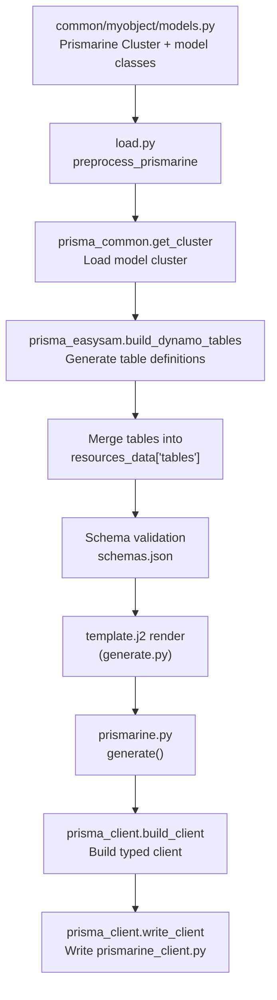

# Prismarine Integration Points

This page documents how EasySAM integrates with the external Prismarine package (`prismarine>=1.6.0`) for model-driven DynamoDB table generation and typed client code. It focuses on the integration boundary and behavior rather than Prismarine internals.

## Integration overview

EasySAM consumes Prismarine at two distinct stages of the generation pipeline:

1. **Preprocessing stage** (`load.py`): Prismarine model clusters are used to generate DynamoDB table definitions that are merged into `resources_data['tables']` before schema validation and template rendering.
2. **Client generation stage** (`prismarine.py`): After the SAM template is rendered, Prismarine generates `prismarine_client.py` containing typed CRUD methods for each model.



*Prismarine is invoked twice: once during resource loading to inject table definitions, and once after template rendering to produce typed client code.*

## The Prismarine package boundary

EasySAM interacts with Prismarine through two submodules:

| Submodule | Imported as | Purpose | Used by |
| --- | --- | --- | --- |
| `prismarine.prisma_common` | `prisma_common` | Cluster loading (`get_cluster`), path setup (`set_path`) | `load.py` |
| `prismarine.prisma_easysam` | `prisma_easysam` | DynamoDB table generation (`build_dynamo_tables`) | `load.py` |
| `prismarine.prisma_client` | `client` | Cluster loading, client building, client writing | `prismarine.py` |

EasySAM does not import or depend on Prismarine's runtime CRUD layer directly — that layer is injected into the generated `prismarine_client.py` by `prisma_client.build_client`.

Sources: `repo://src/easysam/load.py#L11-L12`, `repo://src/easysam/prismarine.py#L4`

## Preprocessing stage — DynamoDB table generation

### Entry point

The preprocessing is orchestrated in `preprocess_prismarine` (called from `preprocess_resources` in `load.py`), which runs before schema validation.

Source: `repo://src/easysam/load.py#L136-L179`

### Processing sequence

1. **Resolve conditional tables**: If `prismarine.conditional-tables` is present, it is resolved via `resolve_conditionals` against the deploy context. Matching entries are appended to `prismarine.tables`.

   Source: `repo://src/easysam/load.py#L143-L148`

2. **Iterate table integrations**: For each entry in `prismarine['tables']`:
   - Resolve `base` (falls back to `default-base` if not specified)
   - Extract `package` name
   - Call `prismarine_dynamo_tables(prefix, base, package, resources_dir, pypath, errors)`

   Source: `repo://src/easysam/load.py#L150-L163`

3. **Generate table definitions**: `prismarine_dynamo_tables` performs:
   - `prisma_common.set_path(pypath)` — sets the Python path for module resolution
   - `prisma_common.get_cluster(base_dir, package)` — loads the Prismarine Cluster from the model file
   - `prisma_easysam.build_dynamo_tables(prefix, cluster)` — generates DynamoDB table definitions

   Source: `repo://src/easysam/load.py#L113-L128`

4. **Merge into resources**: Generated tables are merged into `resources_data['tables']`. If the integration entry does not set `trigger: true`, model-defined triggers are removed from the generated table definitions.

   Source: `repo://src/easysam/load.py#L169-L179`

### Trigger handling

Prismarine models can define a `trigger` attribute (e.g., `@c.model(trigger='itemlogger')`). During preprocessing:

- If the `prismarine.tables` entry has `trigger: true`, the model-defined trigger is **preserved** in the generated table definition.
- Otherwise, the trigger is **stripped** (the `trigger` key is popped from the table definition).

This allows models to define triggers for documentation while controlling whether they're active per-deployment.

Source: `repo://src/easysam/load.py#L172-L177`

### Conditional triggers

Triggers themselves can be conditional. In `example/prismarineconditionals`, the trigger value is wrapped in a `!Conditional`:

```yaml
prismarine:
  tables:
    - package: myobject
      trigger:
        ? !Conditional
          key: function
          environment:
            - prodsam
            - stagingsam
        : itemlogger
```

When the condition does not match (e.g., `environment: dev`), the trigger value resolves to `None`/is absent, so no trigger is attached to the table.

Source: `repo://example/prismarineconditionals/resources.yaml`

### Error handling

If `prismarine_dynamo_tables` returns `None` (e.g., due to an exception), a warning is logged and processing continues with the next table integration. The error is appended to the errors list but does not halt the entire generation.

Source: `repo://src/easysam/load.py#L165-L167`

## Client generation stage

### Entry point

Client generation is invoked in `generate.py` after template rendering, only when `'prismarine' in resources_data`:

```python
if 'prismarine' in resources_data:
    lg.info('Generating prismarine clients')
    generate_prismarine_clients(resources_dir, resources_data, errors)
```

Source: `repo://src/easysam/generate.py#L86-L88`

### Processing sequence

The `generate()` function in `prismarine.py` performs:

1. **Extract configuration**:
   - `default-base` — default directory containing model packages
   - `tables` — list of table integration entries
   - `access-module` — Python module providing DynamoDB access (default: `prismarine.runtime.dynamo_default`)
   - `extra-imports` — additional classes to import (format: `module:ClassName`)
   - `modelling` — modelling mode (`typed-dict` or `pydantic`, default: `typed-dict`)

   Source: `repo://src/easysam/prismarine.py#L13-L17`

2. **Process extra imports**: If `extra-imports` is defined, split each entry on `:` to get `(module, class_name)` pairs.

   Source: `repo://src/easysam/prismarine.py#L19-L28`

3. **For each table integration**:
   - Resolve `base` directory and `package` name
   - Load the cluster via `client.get_cluster(base_dir, package)`
   - **Validate prefix**: The cluster's prefix must start with the master prefix from `resources['prefix']`. If not, an error is appended and client generation for that package is skipped.

     Source: `repo://src/easysam/prismarine.py#L43-L49`

   - Build the client via `client.build_client(cluster, base_dir, base, access_module, extra_imports=extra_imports, model_library=modelling)`
   - Write the client via `client.write_client(content, base_dir, package)` if no errors have been recorded for that package

   Source: `repo://src/easysam/prismarine.py#L30-L58`

### Per-package error isolation

Client generation is not skipped globally when errors occur. Each package is evaluated independently: if errors have been recorded, client generation for that specific package is skipped with a warning, but other packages continue to be processed.

Source: `repo://src/easysam/prismarine.py#L55-L58`

## Configuration reference

The `prismarine` section in `resources.yaml`:

```yaml
prismarine:
  default-base: common
  access-module: common.dynamo_access
  modelling: typed-dict          # or: pydantic
  extra-imports:
    - common.myobject.models:NestedItem
  tables:
    - package: myobject
      base: common               # overrides default-base
      trigger: true              # keep model-defined triggers
  conditional-tables:
    ? !Conditional
      key: prod-tables
      environment: prod
    :
      - package: prodobject
```

| Field | Description | Required | Default |
| --- | --- | --- | --- |
| `default-base` | Directory containing model packages | Yes | — |
| `access-module` | Python module providing DynamoDB access | No | `prismarine.runtime.dynamo_default` |
| `modelling` | Modelling mode: `typed-dict` or `pydantic` | No | `typed-dict` |
| `extra-imports` | Additional classes to import (`module:ClassName`) | No | `[]` |
| `tables` | List of `{package, base, trigger}` entries | No | `[]` |
| `conditional-tables` | Environment/region-conditional table packages | No | `{}` |

Sources: `repo://src/easysam/load.py#L136-L149`, `repo://src/easysam/prismarine.py#L7-L17`

## Modelling modes

### TypedDict mode (default)

In `typed-dict` mode:
- Models use Python `TypedDict` for definitions
- The generated `UpdateDTO` is a `TypedDict` with `total=False`
- Methods accept and return plain `TypedDict` instances
- No runtime validation occurs

Source: `repo://example/prismarine/common/myobject/prismarine_client.py#L28-L36`

### Pydantic mode

In `pydantic` mode:
- Models use Pydantic `BaseModel` for definitions
- The generated client uses Pydantic's `model_dump`/`model_validate` for serialization/deserialization
- A `_build_pydantic_update_model` helper dynamically creates an update DTO with all fields made optional
- `_dump_model` / `_load_model` helpers handle dict conversion

Requires Prismarine ≥ 1.5.5 (fixed in v1.11.1).

Source: `repo://example/prismapydantic/common/myobject/prismarine_client.py#L1-L100`

## Generated client code

After template rendering, `prismarine_client.py` is written to the `base` directory (e.g., `common/myobject/prismarine_client.py`). The generated file:

- Includes a version stamp header: `# This file is generated by prismarine 1.6.1. Do not modify it.`
- Imports from `prismarine.runtime.dynamo_crud` (CRUD primitives: `_query`, `_get_item`, `_put_item`, `_update`, `_delete`, `_scan`, `_save`, `Model`, `without`, `DbNotFound`)
- Imports the model classes from the package's `models.py`
- Instantiates the DynamoDB resource via `get_dynamo_access()`
- Defines a `*Model` class (named after the model class) with typed CRUD methods: `list`, `get`, `put`, `update`, `save`, `delete`, `scan`

Source: `repo://example/prismarine/common/myobject/prismarine_client.py`

## The db.py re-export pattern

The generated `prismarine_client.py` lives in the package directory (e.g., `common/myobject/prismarine_client.py`). The scaffold creates a `db.py` in the same package that re-exports the client model:

```python
import common.myobject.prismarine_client as pc

class ItemModel(pc.ItemModel):
    pass
```

This pattern lets application code import `ItemModel` from `common.myobject.db` without depending on the generated `__init__` import structure. The `db.py` file is created by `init.py` when `--prismarine` mode is used, alongside `models.py`.

Source: `repo://example/prismarine/common/myobject/db.py`

## Access module

The `access-module` (default scaffold: `common.dynamo_access`) provides the DynamoDB connection layer. The scaffolded implementation:

```python
import boto3
from prismarine.runtime.dynamo_access import DynamoAccess
from common.utils import get_env

class MyDynamoAccess(DynamoAccess):
    def get_resource(self):
        return boto3.resource('dynamodb')

    def get_table(self, full_model_name: str):
        env = get_env()
        return self.get_resource().Table(f'{full_model_name}-{env}')

dynamoaccess = MyDynamoAccess()

def get_dynamo_access():
    return dynamoaccess
```

The access module is injected into the generated client, allowing runtime table resolution with environment suffixing. The module is resolved from the `base` directory, so `common.dynamo_access` means `common/dynamo_access.py`.

Source: `repo://example/prismarine/common/dynamo_access.py`

## Prefix validation

A critical integration constraint: the Prismarine Cluster prefix **must start with** the EasySAM `prefix` from `resources.yaml`. This is validated in `prismarine.py` during client generation:

```python
if not cluster.prefix.startswith(resources['prefix']):
    errors.append(
        f'When using with EasySAM, a Prismarine Cluster prefix ({cluster.prefix}) must start with the master prefix ({resources["prefix"]})'
    )
    continue
```

This ensures that generated DynamoDB table names (which incorporate the prefix) are consistent with the overall resource naming scheme.

Source: `repo://src/easysam/prismarine.py#L43-L49`

## Example: resources.yaml

From `example/prismarine/resources.yaml`:

```yaml
prefix: MyAppWithPrismarine

import:
  - backend

prismarine:
  default-base: common
  access-module: common.dynamo_access
  tables:
    - package: myobject
```

This configures:
- Master prefix: `MyAppWithPrismarine`
- Model base directory: `common/`
- Access module: `common.dynamo_access`
- One table package: `myobject` (loaded from `common/myobject/models.py`)

Source: `repo://example/prismarine/resources.yaml`

## Relationship to other components

- **Resource model** (`/openwiki/domain/resource-model.md`): Prismarine config lives under the `prismarine:` key in `resources.yaml` and participates in the same conditional resolution and override machinery as other resource sections.
- **Generate and deploy workflow** (`/openwiki/workflows/generate-deploy.md`): Prismarine client generation is the last step in the generate path, after template rendering.
- **Source map** (`/openwiki/architecture/source-map.md`): `prismarine.py` is listed as the Prismarine integration module; `load.py` handles preprocessing; `validate_schema.py` handles Prismarine-specific validation.
- **Schema validation** (`validate_schema.py`): Validates that `default-base` and each table's `base` are existing directories relative to `resources_dir`.

Source: `repo://src/easysam/validate_schema.py#L255-L275`
