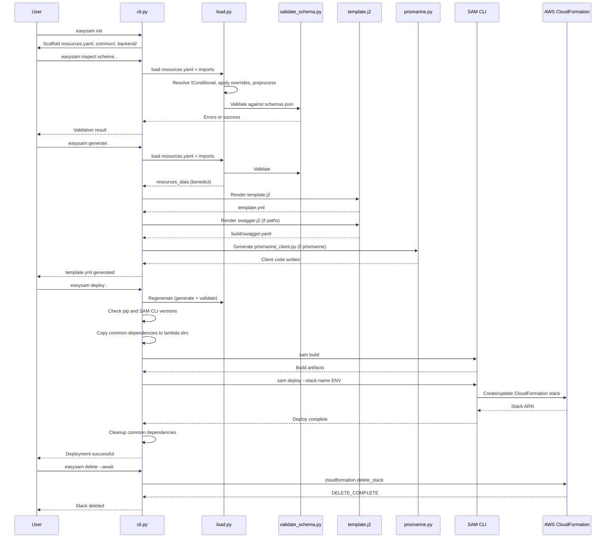

# Generate and Deploy Workflow

This page documents the end-to-end lifecycle of an EasySAM project: initialization, validation, template generation, AWS deployment, and teardown.

## Lifecycle overview



*Sequence of CLI commands from init through deploy to delete.*

## 1. Init (`easysam init`)

Source: `src/easysam/init.py`

Creates a minimal project structure:

```
my-app/
├── resources.yaml          # prefix + import list
├── .gitignore              # build artifacts excluded
├── common/
│   └── utils.py            # shared utility module
├── backend/
│   ├── database/
│   │   └── easysam.yaml    # table definition (MyItem)
│   └── function/
│       └── myfunction/
│           ├── easysam.yaml # lambda + integration
│           └── index.py     # handler
└── thirdparty/
    └── requirements.txt    # boto3
```

With `--prismarine`, the scaffold includes Prismarine model files (`common/myobject/models.py`, `db.py`), a `dynamo_access.py` access module, and a trigger lambda (`itemlogger`) with a DynamoDB stream handler.

Requires `pyproject.toml` in the current directory.

## 2. Validate (`easysam inspect schema`)

Source: `src/easysam/inspect.py`, `src/easysam/validate_schema.py`

Loads and resolves all resources (including conditionals and imports), then validates against:

- **`schemas.json`** — JSON Schema Draft 7 for the global `resources.yaml` structure
- **`local_schemas.json`** — per-file schema for each `easysam.yaml`
- **Custom validators** — bucket rules (private can't be public), table trigger function existence, stream bucket validation, path/authorizer mutual exclusivity, MQTT config, Prismarine config

Use `--select functions.myfunction` to render a specific subsection of resolved resources for debugging.

```bash
easysam --environment dev inspect schema .
```

## 3. Cloud validation (`easysam inspect cloud`)

Source: `src/easysam/validate_cloud.py`

Checks live AWS resources that EasySAM depends on but does not create:

- **IAM policies** for bucket `extaccesspolicy` references (must exist as `<PolicyName>-<environment>`)
- **SSM parameters** for custom Lambda layers referenced via `{{resolve:ssm:...}}`
- **Lambda layer ARNs** — verifies the layer version exists

Requires `--aws-profile` and `--environment`.

```bash
easysam --environment dev --aws-profile my-profile inspect cloud .
```

## 4. Generate (`easysam generate`)

Source: `src/easysam/generate.py`

Runs the full load+validate pipeline, then renders the SAM template:

1. Calls `load.resources()` to produce the resolved `resources_data` dict
2. Executes plugins (if defined) to generate custom YAML fragments
3. Renders `template.j2` → `template.yml`
4. Renders `swagger.j2` → `build/swagger.yaml` (only if API `paths` are defined)
5. Calls `prismarine.generate()` to write `prismarine_client.py` (if Prismarine is configured)

Output goes to the project directory. The `template.yml` is the primary artifact consumed by SAM.

```bash
easysam --environment dev generate .
```

## 5. Deploy (`easysam deploy`)

Source: `src/easysam/deploy.py`

Wraps the SAM CLI deployment:

1. **Regenerates** the template (calls `generate()` internally — no separate generate step needed)
2. **Version checks** — pip ≥ 25.1.1, SAM CLI ≥ 1.138.0
3. **Common dependency copy** — uses `commondep.py` to AST-trace `common.*` imports in each lambda, copies only needed modules into the lambda directory
4. **`sam build`** — compiles the SAM template
5. **`sam deploy`** — deploys with `--stack-name <environment>`, `--capabilities CAPABILITY_IAM CAPABILITY_NAMED_IAM`, tags, and region
6. **Cleanup** — removes copied common dependencies (unless `--no-cleanup`)

```bash
easysam --environment dev --aws-profile my-profile deploy . --tag project=myapp
```

Key deploy options:
- `--dry-run` — print the SAM deploy command without executing
- `--sam-tool` — override the SAM invocation (default: `uv run sam`)
- `--override-main-template` — use a custom Jinja template instead of `template.j2`
- `--tag key=value` — repeatable CloudFormation tags

## 6. Delete (`easysam delete`)

Source: `src/easysam/deploy.py:delete`

Calls CloudFormation `delete_stack` directly (not via SAM CLI):

- `--force` — uses `FORCE_DELETE_STACK` deletion mode
- `--await` — polls stack status until `DELETE_COMPLETE`

```bash
easysam --environment dev --aws-profile my-profile delete --await
```

## Common dependency management

Source: `src/easysam/commondep.py`

During deploy, EasySAM needs to package shared `common/` code into each Lambda function directory. The `commondep` module:

1. Scans `common/` for available packages (directories and `.py` files, excluding `__`-prefixed)
2. Parses each lambda's Python files using `ast` to find `import common.X` and `from common.X import ...` statements
3. Recursively traces transitive dependencies (if `common.a` imports `common.b`, both are included)
4. Copies resolved dependencies into the lambda directory
5. Cleans up after deploy (unless `--no-cleanup`)

You can inspect dependencies without deploying:

```bash
easysam inspect common-deps backend/function/myfunction
```

## CI/CD recommended pipeline

The [Production Hardening guide](../../docs/PRODUCTION_HARDENING.md) recommends:

```bash
easysam --environment prod --context-file deploy-context.yaml inspect schema .
easysam --environment prod --context-file deploy-context.yaml inspect cloud .
easysam --environment prod --context-file deploy-context.yaml generate .
easysam --environment prod --context-file deploy-context.yaml deploy .
```

See [Operations Runbook](../operations/runbook.md) for more on validation and deployment safety.
