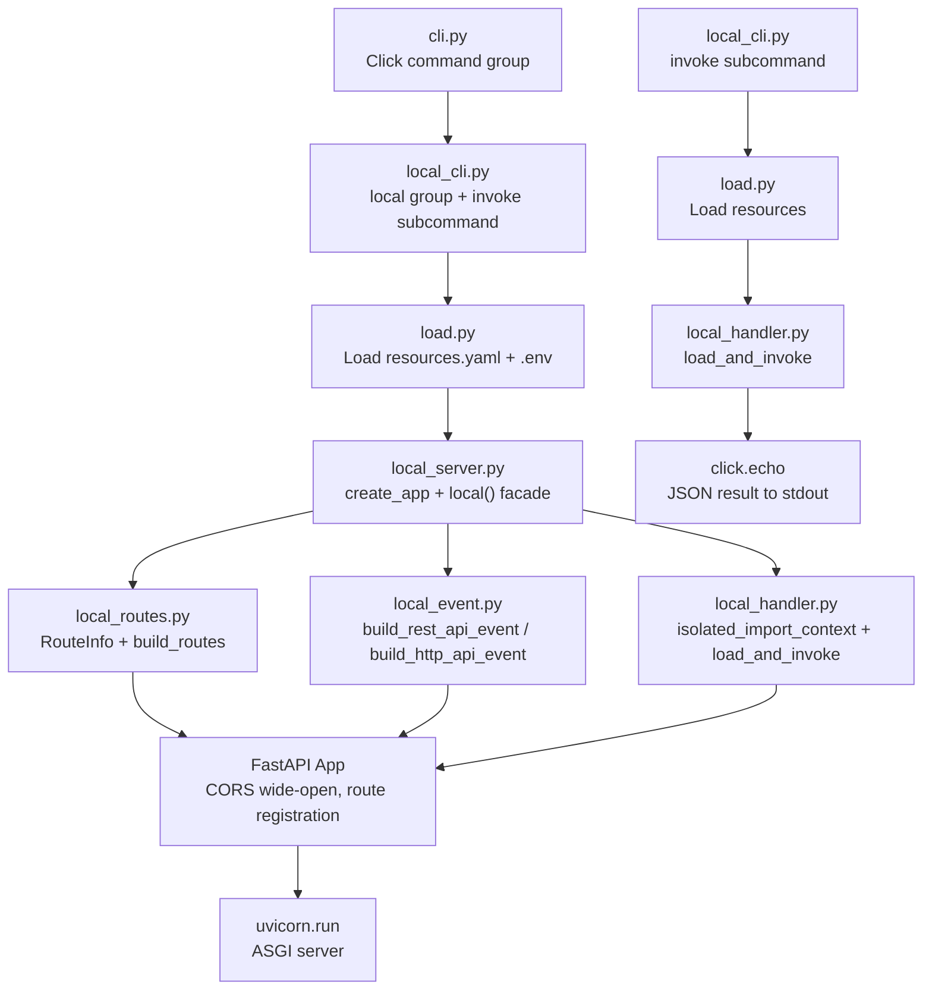
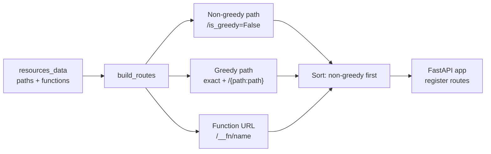
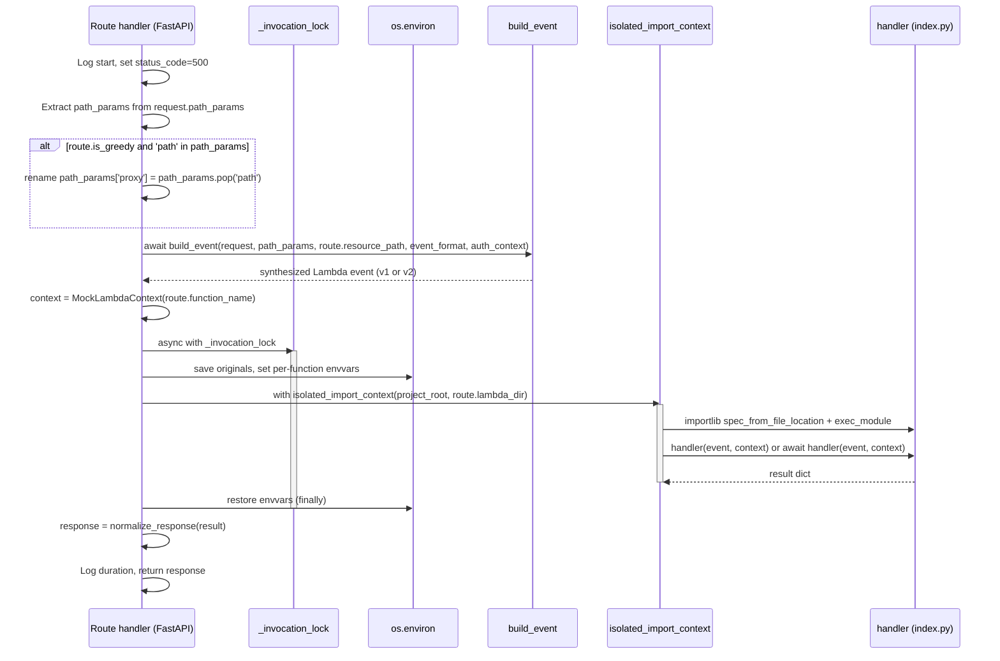

# Local Execution Workflow

The local execution workflow reuses the same `load.resources()` pipeline that drives cloud generation and deployment, then maps the resolved resource model to a FastAPI application whose per-request lifecycle synthesizes API Gateway events, imports handler modules in isolation, invokes them under a serialization lock with per-function environment variable swapping, and normalizes the result to an HTTP response. Two entry points share this machinery: `easysam local .` starts the HTTP server, and `easysam local invoke <function>` invokes a single handler with a custom event without starting the server.

## Entry points

The local execution surface lives in `src/easysam/local_cli.py` (Click command group) and `src/easysam/local_server.py` (FastAPI application factory and facade). The CLI wiring is a parallel branch from the generate/deploy path: `cli.py` registers the `local` sub-group, and each command receives `ctx.obj` carrying `verbose`, `aws_profile`, and `deploy_ctx` (with `environment` and `target_region`).

- `easysam local .` — starts the local HTTP server. The Click `local` group has `invoke_without_command=True`, so running it without a subcommand starts the server directly.
- `easysam local invoke <function>` — invokes a single Lambda handler with a custom event. Accepts `--event` as a JSON file path, inline JSON string, or defaults to `{}`. Also the entry point for non-HTTP trigger testing (SQS, Kinesis, DynamoDB streams) where no API Gateway event is synthesized.

Both entry points call into `local_server.py`: the server path uses the `local()` facade, and the invoke path calls `load_and_invoke()` directly.

*The local execution path splits into two branches from the CLI. The server branch builds a FastAPI app and runs uvicorn; the invoke branch calls `load_and_invoke` once and prints the result.*

## Resource loading and startup environment

The `local()` facade in `local_server.py` is the CLI-facing entry point for the server. It performs the following at startup:

1. **Load and resolve resources** via `load.resources()` from the same `load.py` module that the cloud pipeline uses. This applies `!Conditional` resolution, recursive `easysam.yaml` imports, Prismarine preprocessing, defaults, and schema validation against the deploy context (`environment`, `target_region`). Resource loading errors are logged and raise `UserWarning` if any occur.

2. **Set global environment variables** from `resources_data['envvars']` into `os.environ`. These are the global envvars declared in `resources.yaml`.

3. **Inject AWS region** — if `target_region` is set in the deploy context (or `EASYSAM_TARGET_REGION` is already in the environment), set `AWS_DEFAULT_REGION` and `AWS_REGION` to that value. This is done with `os.environ.setdefault` so an already-present value is not overwritten.

4. **Inject AWS profile** — if an `aws_profile` is provided (or `EASYSAM_AWS_PROFILE` is already set), set `AWS_PROFILE` with `os.environ.setdefault`.

5. **Build the FastAPI app** via `create_app(resources_data, directory, event_format, auth_context)` and run it with `uvicorn.run(app, host=host, port=port)`.

The default bind address is `127.0.0.1:3000` (loopback only), and the default event format is `v1` (REST API), matching current EasySAM template generation.

The `local()` function signature accepts `directory`, `deploy_ctx`, `port`, `host`, `event_format`, `auth_context`, and `aws_profile`. It is both called by `local_cli.py` and available for programmatic use.

## Route construction

Route construction is the bridge between the resolved resource model and the FastAPI application. It is implemented in `local_routes.py` as `build_routes(resources_data, project_root) -> list[RouteInfo]`.

### RouteInfo

Each route is described by a `RouteInfo` dataclass with the following fields:

- `path` — the FastAPI route path (e.g., `/items`, `/items/{path:path}`, `/__fn/hello`).
- `function_name` — the Lambda function name from the resource model.
- `lambda_dir` — absolute `Path` to the lambda source directory (resolved from `functions[name]['uri']`).
- `is_greedy` — whether this route is a catch-all.
- `is_function_url` — whether this is a `/__fn/` function URL route.
- `resource_path` — the original EasySAM path template, used by the event builders.

### Path processing

`build_routes` processes two sections of the resource model:

**API Gateway paths** (`resources_data['paths']`): For each path entry with `integration == 'lambda'` or a `function` key, the builder resolves the function's `uri` to a `lambda_dir` and creates one or two `RouteInfo` entries:

- **Non-greedy paths** (`greedy: false`, no trailing slash): a single exact route with `is_greedy=False`.
- **Greedy paths** (`greedy: true` or path key ends with `/`): two routes — an exact route (trailing slash stripped) with `is_greedy=False`, and a catch-all route `f'{api_path}/{{path:path}}'` with `is_greedy=True`. The catch-all's `resource_path` is set to `f'{api_path}/{{proxy+}}'` so the event builders can map the FastAPI `{path:path}` parameter to `pathParameters["proxy"]` for AWS parity.

**Function URLs** (`functions[name]['functionurl']`): For each function with a `functionurl` property, a separate route is registered at `/__fn/{name}` with `is_function_url=True`. These are processed independently of the `paths` section.

### Sorting

Routes are sorted with `routes.sort(key=lambda r: r.is_greedy)`, so non-greedy routes (exact paths and function URLs) are registered before greedy catch-all routes. This prevents FastAPI/Starlette from matching a greedy `/{path:path}` route before an exact `/items` route. The sorting was a critique recommendation and a Pass 1 finding — without it, Starlette can shadow exact routes with greedy catch-alls.

*`build_routes` converts the resource model into specificity-sorted `RouteInfo` descriptors. Greedy paths expand into exact + catch-all pairs, and function URLs are registered separately under `/__fn/`.*

## FastAPI application factory

`create_app(resources_data, project_root, event_format, auth_context)` in `local_server.py` builds the FastAPI application:

1. Creates a `FastAPI(title='EasySAM Local Server')`.
2. Adds CORS middleware with wide-open settings for local development: `allow_origins=['*']`, `allow_methods=['*']`, `allow_headers=['*']`, `allow_credentials=False`.
3. Calls `build_routes(resources_data, project_root)` to get the route descriptors.
4. Iterates over the routes and registers each one via `_register_route()`.

### Per-route registration

`_register_route()` in `local_server.py` does the following for each `RouteInfo`:

1. Looks up the function's configuration from `functions[route.function_name]` to get `func_envvars`.
2. Defines an async `route_handler(request: Request) -> Response` that implements the per-request lifecycle.
3. Registers the handler on the FastAPI app with `app.api_route(route.path, methods=all_methods, name=route_handler.__name__)(route_handler)`. The handler is given a unique name (`handle_{function_name}_{sanitized_path}`) to avoid FastAPI route conflicts when multiple routes map to the same function.

The `all_methods` list includes `GET`, `POST`, `PUT`, `DELETE`, `PATCH`, `HEAD`, `OPTIONS`. All methods are registered for every route, matching the typical EasySAM pattern where a single Lambda handles all HTTP methods on a path.

## Per-request lifecycle

The core of the local execution workflow is the per-request lifecycle implemented in the async `route_handler` closure. It flows through five stages: request logging, path parameter extraction, event synthesis outside the lock, handler invocation under the lock with envvar swapping, and response normalization.

*The per-request lifecycle. Event synthesis and body reading happen outside the serialization lock; handler invocation, envvar swapping, and module isolation happen inside it; response normalization happens after the lock is released.*

### Request start and path parameter handling

The handler records `start = time.perf_counter()` and initializes `status_code = 500`. It extracts `path_params = dict(request.path_params)`.

For greedy routes, if `'path'` is in `path_params`, the handler renames it to `'proxy'`: `path_params['proxy'] = path_params.pop('path')`. This was a Pass 1 HIGH finding — the earlier code unconditionally popped `path`, which corrupted `{path}` params on non-greedy routes. The current implementation checks `if route.is_greedy and 'path' in path_params:` before the rename.

### Event synthesis (outside the lock)

The handler calls `await build_event(request, path_params, route.resource_path, event_format, auth_context)` **outside** the serialization lock. This means concurrent requests do not block on reading the request body or building the event. The event is a synthesized Lambda event in either v1 (REST API) or v2 (HTTP API) format.

Building the event outside the lock was a Pass 1 MEDIUM finding — earlier code entered the lock before reading the request body, causing request body lock contention.

The handler also creates a `MockLambdaContext(function_name=route.function_name)` at this point.

### Serialization lock and envvar swapping

The handler enters `async with _invocation_lock:` where `_invocation_lock` is a module-level `asyncio.Lock()` defined in `local_server.py`. All per-function envvar mutations and handler invocation happen inside this lock.

Inside the lock:

1. **Save originals**: For each `(key, value)` in `func_envvars`, save `saved_env[key] = os.environ.get(key)` (which may be `None` if the key was not set), then set `os.environ[key] = str(value)`.

2. **Invoke handler**: Call `await load_and_invoke(project_root, route.lambda_dir, event, context)`.

3. **Restore envvars** in a `finally` block: For each `(key, original)` in `saved_env`, if `original is None`, remove the key with `os.environ.pop(key, None)`, otherwise restore `os.environ[key] = original`.

The lock and `try...finally` were a Must-Address finding in the second critique pass (E2_2) — without them, an unhandled exception in `load_and_invoke` or event building would deadlock the server by leaving `_invocation_lock` permanently acquired and `os.environ` mutated.

### Handler isolation and invocation

`load_and_invoke()` in `local_handler.py` implements handler isolation and invocation. It takes `project_root`, `lambda_dir`, `event`, and `context` and returns the handler result dict.

The isolation is implemented by the `isolated_import_context(project_root, lambda_dir)` context manager:

1. **Resolve paths to absolute**: `project_root_abs = str(project_root.resolve())` and `lambda_dir_abs = str(lambda_dir.resolve())`. This ensures reliable module file matching across platforms (a Pass 1 finding — incomplete cleanup on Windows due to unresolved `__file__` paths).

2. **Clean stale `common.*` modules on entry**: Iterate `sys.modules` and remove any `common.*` modules whose `__file__` resolves under `project_root`, plus stale `common.*` modules from other projects. This ensures `common/` edits take effect on every request and prevents cross-project pollution.

3. **Set `sys.path`**: `sys.path = [lambda_dir_abs, project_root_abs] + sys.path`. This places the lambda directory first (so the handler's local modules resolve before anything else) and the project root second (so `import common.utils` resolves from source). Third-party packages remain later in `sys.path`.

4. **Import the handler**: Inside the context, use `importlib.util.spec_from_file_location()` with a unique module name (`_easysam_local_{uuid.hex[:8]}`) to load `lambda_dir/index.py`, execute the module, and read `module.handler`. The unique name prevents collisions between concurrent-style imports in `sys.modules`.

5. **Dispatch on handler type**: If `inspect.iscoroutinefunction(handler)`, await it directly. Otherwise, run it in a freshly created event loop executed via `asyncio.get_event_loop().run_in_executor(None, _invoke_sync)`. This supports both async and sync handlers.

6. **Purge local modules on exit**: In the `finally` block, iterate `sys.modules` and delete any module whose resolved `__file__` starts with `project_root_abs` or `lambda_dir_abs`. Third-party packages (boto3, pydantic, etc.) are left in `sys.modules`. This selective purge was a Must-Address finding in the second critique pass (E1_2) — the earlier sketch only purged `new_modules`, which failed to reload modified `common/` files.

The `context` parameter is a `MockLambdaContext`, a dataclass that provides a minimal mock of the AWS Lambda context object: `function_name`, `memory_limit_in_mb` (default 128), `invoked_function_arn` (auto-generated as `arn:aws:lambda:us-east-1:123456789012:function:{name}`), `aws_request_id` (random UUID), `log_group_name` (`/aws/lambda/local`), `log_stream_name` (auto-generated), and `get_remaining_time_in_millis()` (returns 300000).

### Response normalization

After the lock is released, the handler calls `normalize_response(result)` to translate the Lambda handler output to an HTTP response. This function in `local_server.py` handles several cases:

- **`None`**: returns an empty 200 response.
- **Dict with `statusCode`**: uses the status code, headers, and body. If `isBase64Encoded: True` and body is present, decodes the body from base64. If the body is a dict, JSON-encodes it. Media type defaults to the `Content-Type` header or `application/json`.
- **Dict without `statusCode`**: auto-wraps as JSON 200 (API Gateway v2 parity). This was a Must-Address finding in the first critique pass (P1).
- **String or primitive**: wrapped as plain text 200.

Exception handling wraps the entire try block: if the handler or event building raises an `Exception`, the traceback is formatted with `traceback.format_exc()`, logged at error level, and a 500 response with the traceback as plain text is returned.

Structured request logging uses the format `[METHOD] /path -> FunctionName (statusCode, duration_ms)` with `time.perf_counter()` for duration. This was a critique recommendation (P3) for observability.

## Event formats

The server supports two API Gateway event formats, selectable via `--event-format v1|v2` (default `v1`). Event synthesis is implemented in `local_event.py`.

### v1 — REST API

`build_rest_api_event()` synthesizes the v1 structure with:

- `resource` — the resource path template (e.g., `/items/{id}`).
- `path` — the request URL path.
- `httpMethod` — the request method.
- `headers` — original-case headers from the request.
- `multiValueHeaders` — multi-value headers using `request.headers.items()`.
- `queryStringParameters` — single-value query params (last value wins).
- `multiValueQueryStringParameters` — multi-value query params using `request.query_params.multi_items()`.
- `pathParameters` — path parameters from route matching.
- `body` — the request body.
- `isBase64Encoded` — whether the body is base64-encoded.
- `requestContext` — containing `resourcePath`, `httpMethod`, `path`, `stage: 'local'`, `requestId`, `identity.sourceIp`, and `authorizer` from the injected auth context.

Multi-value headers and query parameters are preserved using `request.headers.items()` and `request.query_params.multi_items()`. The second critique pass flagged this explicitly (E3_2) — converting `dict(request.query_params)` directly would truncate repeated query keys, so the implementation uses `multi_items()` to build `multiValueQueryStringParameters` correctly.

### v2 — HTTP API

`build_http_api_event()` synthesizes the v2 structure with:

- `version: '2.0'`.
- `routeKey` — e.g., `GET /items/{id}`.
- `rawPath` — the request URL path.
- `rawQueryString` — the raw query string.
- `headers` — lowercase, comma-joined for multiples.
- `queryStringParameters` — comma-joined for duplicates.
- `pathParameters` — path parameters from route matching.
- `body` — the request body.
- `isBase64Encoded` — whether the body is base64-encoded.
- `requestContext` — containing `http` (method, path, sourceIp), `authorizer.lambda` (wrapping the auth context), `time`, and `timeEpoch`.

### Binary payloads

Both builders share `_get_body()`, which reads the request body and base64-encodes it when the content type is in `BINARY_CONTENT_TYPES` (`application/octet-stream`, `image/png`, `image/jpeg`, `image/gif`, `image/webp`, `application/pdf`, `application/zip`). Otherwise the body is decoded as UTF-8 with error replacement.

### Auth context injection

Authorizers are not executed locally. Instead, `--auth-context` (a JSON file path or inline JSON string) provides a fixed `requestContext.authorizer` payload injected into every request's event. The CLI parses it with `_parse_json_option()`, which tries file path first (trapping `OSError`/`ValueError` on Windows for inline JSON strings — a Pass 1 HIGH finding), then falls back to inline JSON parsing. If omitted, the default is `{}`. The injection differs by format: v1 puts the dict directly under `requestContext.authorizer`; v2 wraps it under `requestContext.authorizer.lambda`.

## CLI surface

### `easysam local .`

The `local` Click group in `local_cli.py` is defined with `invoke_without_command=True`. When run without a subcommand, it starts the server.

Options:

- `--port` (int, default 3000)
- `--host` (str, default `127.0.0.1`)
- `--event-format` (choice: `v1`, `v2`, default `v1`)
- `--auth-context` (str, optional — JSON file path or inline JSON string)
- `directory` (argument, default `.`, must exist)

When a subcommand is invoked (`local invoke`), the group stores the parameters in `ctx.obj['local_params']` and returns early. Otherwise it parses the auth context, loads resources, and calls the `local_facade` (the `local()` function in `local_server.py`).

### `easysam local invoke <function>`

The `invoke` subcommand accepts a required function name and an optional `--event` (default `{}`). The `--event` value can be:

- A file path (if the path exists and is a file, the JSON is read from it)
- An inline JSON string (e.g., `'{"key":"value"}'`)
- Omitted, defaulting to `{}`

The command loads resources, resolves the function's `uri` to a `lambda_dir`, sets global and per-function envvars, creates a `MockLambdaContext`, invokes the handler via `asyncio.run(load_and_invoke(...))`, and prints the result as JSON with `json.dumps(result, indent=2, default=str)`. The `default=str` fallback was a Pass 2 recommendation (P2_2) to handle non-serializable types like `Decimal` and `datetime` without crashing.

`local invoke` does not start the HTTP server — it loads resources, sets envvars, and invokes the handler once, printing the result to stdout. It is suitable for testing non-HTTP triggers (SQS, Kinesis, DynamoDB streams) where there is no API Gateway event to synthesize.

## Relationship to the cloud pipeline

The local server reuses `load.resources()` from `load.py`, so it sees the same resolved resource model (conditionals applied, imports merged, defaults set, Prismarine tables preprocessed) that drives `generate` and `deploy`. It does not perform template rendering, SAM build, or CloudFormation deployment.

The key difference from deployment is how `common/` is resolved. During `deploy`, `commondep.py` AST-analyzes each lambda's imports and copies only the used `common/` modules into each lambda's directory. In local mode, that copy step is skipped entirely — `sys.path` is set to `[lambda_dir, project_root]` so `import common.utils` resolves directly from source. This is faster and reflects source edits immediately, but depends on the selective `sys.modules` purge to pick up `common/` changes between requests.

## What is not in v1

- **Hot reload**: Deferred. The brainstorming phase explicitly deferred `watchfiles`-based auto-restart.
- **Authorizer execution**: Authorizer Lambdas are not executed locally; auth is stubbed via `--auth-context`.
- **Local timeouts**: Function `timeout` values from `resources.yaml` are not enforced locally. The critique raised this as an open question (Q1) about whether to enforce local timeout via `asyncio.wait_for` or allow infinite execution for debugging; the implementation allows infinite execution.
- **Docker/SAM local parity**: The feature is intentionally lighter than `sam local start-api` — no Docker, no SAM build step, in-process handler invocation.
- **Per-route auth context**: `--auth-context` is global — all routes get the same injected authorizer context. There is no per-route auth context selection.

## Test coverage

The feature's test suite (74 cases) is organized around the module boundaries:

- **Handler isolation tests** (`tests/test_local_handler.py`): verify `sys.path` sandbox and `sys.modules` cleanup, including two temp lambdas with conflicting `helpers.py` modules that do not cross-contaminate, and an `async def handler` that returns correctly. Also tests `MockLambdaContext` field population.
- **Event synthesis tests** (`tests/test_local_event.py`): 16 cases covering v1/v2 payload formats, headers, binary bodies, and auth context injection (including empty auth context producing an empty authorizer object).
- **Server and route tests** (`tests/test_local_server.py`): 17 cases covering FastAPI app factory, response translation (standard response, dict without statusCode, None, string, base64-encoded), per-function envvars, v2 event format, auth context injection, greedy routes, and CORS headers.
- **Routes tests** (`tests/test_local_routes.py`): unit tests with sample `resources_data` containing greedy, non-greedy, and function-url entries; verify correct route list and ordering (exact before greedy).
- **E2E tests** (`tests/test_local_e2e.py`): loads `example/myapp` resources, creates the app, uses `TestClient` to verify GET `/items` returns 200 with output from `my_common_function()`, undefined routes return 404, CORS headers are present, v1/v2 event formats work, auth context is injectable, and repeated requests get fresh handler imports.
- **Envvar tests** (`tests/test_local_envvars.py`): .env file loading and template interpolation.

## Operational notes

- The server binds to `127.0.0.1` by default (not `0.0.0.0`), so it is only reachable from the local machine.
- CORS is wide-open (`allow_origins=['*']`, `allow_methods=['*']`, `allow_headers=['*']`, `allow_credentials=False`) specifically for local development. This is expected and appropriate for a local dev server.
- `--auth-context` is global — all routes get the same injected authorizer context.
- The `--event-format` default is `v1` (REST API), matching current EasySAM template generation. Switching to `v2` changes both the synthesized event structure and the response normalization behavior (v2 allows simple dict returns without `statusCode`).
- Per-request path parameter handling renames `path` to `proxy` only for greedy routes, preserving `{path}` params on non-greedy routes.
